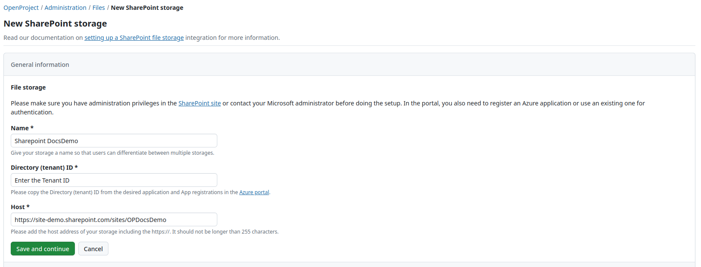
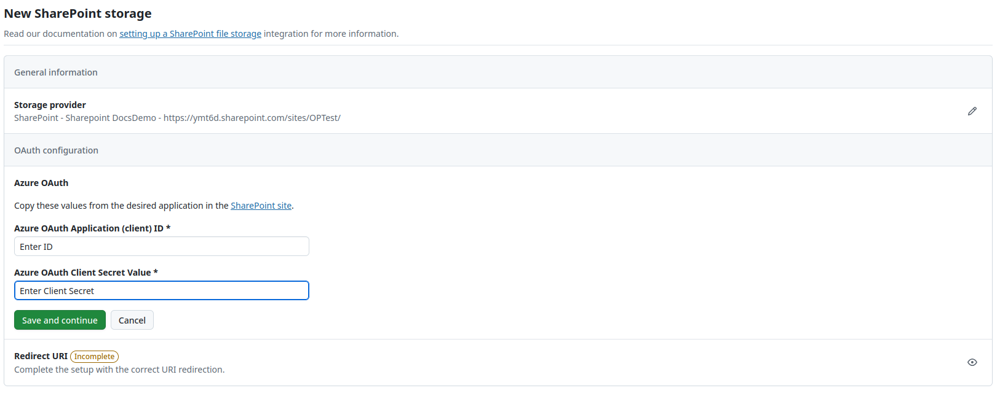
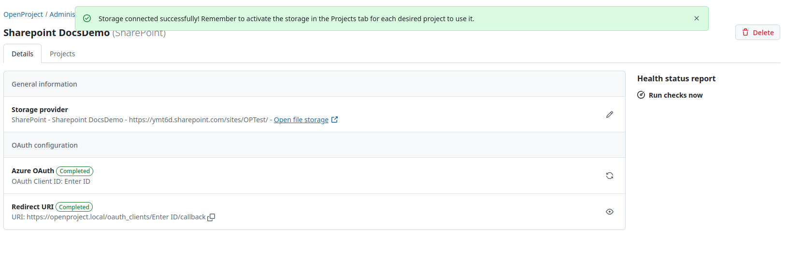
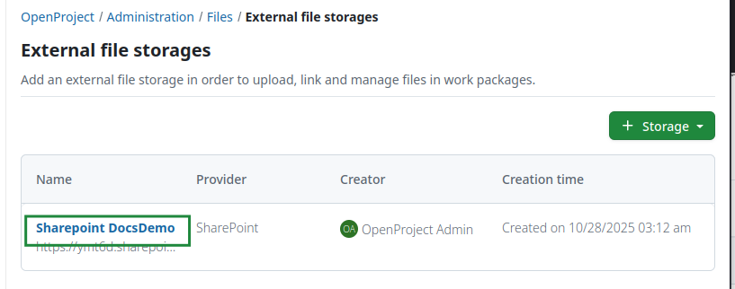
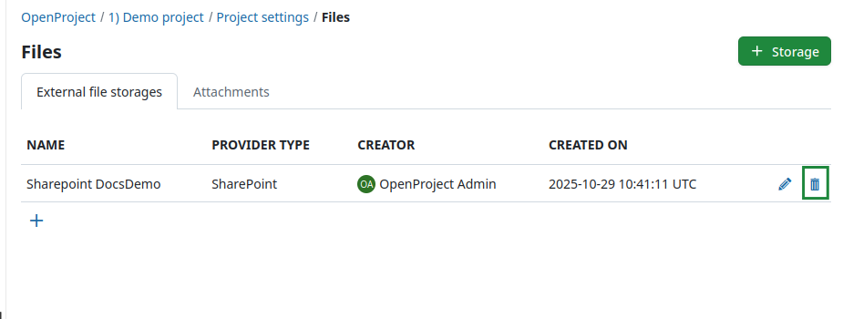

---
sidebar_navigation:
  title: SharePoint integration setup
  priority: 601
description: Set up SharePoint as a file storage in your OpenProject instance
keywords: SharePoint, file storage, integration
---

# SharePoint (Enterprise add-on) integration setup

| Topic                                                        | Description                                                  |
| ------------------------------------------------------------ | :----------------------------------------------------------- |
| [Minimum requirements](#minimum-requirements)                | Minimum version requirements to enable the integration       |
| [Set up the integration](#set-up-the-integration)            | Connect OpenProject and SharePoint instances as an administrator |
| [Sharepoint site setup guide](./site-guide)                                   | How to set the necessary permission on your SharePoint site  |
| [Using the integration](#using-the-integration)              | How to use the SharePoint integration                        |
| [Edit a SharePoint file storage](#edit-a-sharepoint-file-storage) | Edit a SharePoint file storage                               |
| [Delete an SharePoint file storage](#delete-a-sharepoint-file-storage) | Delete a SharePoint file storage                             |

> [!NOTE]
> SharePoint integration is an Enterprise add-on and can only be used with [Enterprise cloud](../../../enterprise-guide/enterprise-cloud-guide/) or [Enterprise on-premises](../../../enterprise-guide/enterprise-on-premises-guide/). An upgrade from the free Community edition is easy and helps support OpenProject.

OpenProject offers an integration with SharePoint to allow users to:

- Link files and folders stored in SharePoint with OpenProject work packages
- View, open and download files and folders linked to a work package via the Files tab

The goal here is to provide access to all the *Document Libraries* in a SharePoint site, as a file storage system for OpenProject.

> [!NOTE]
> This guide only covers the integration setup. Please go to our [SharePoint integration user guide](../../../user-guide/file-management/one-drive-integration/) to learn more about how to work with the SharePoint integration.

## Minimum requirements

Please note these minimum version requirements for the integration to work with a minimal feature set:

- OpenProject version 17.0 (or above)
- Access to a SharePoint site

We recommend using the latest version of OpenProject to be able to use the latest features.

## Set up the integration

> [!IMPORTANT]
> You need administrator privileges in the Azure portal for your Microsoft Entra ID and in your OpenProject instance to set up this integration.
>
> Please make sure that you configure your Azure application to have the following **API permissions**:
>
> - Files.ReadWrite.All - Type: Delegated
> - Sites.Selected - Type: Application
> - offline_access - Type: Delegated
> - User.Read - Type: Delegated

Navigate to **System administration -> File storages**. You will see the list of all storages that have already been set up. If no files storages have been set up yet, a banner will tell you that there are no storages yet set up.

Click the green **+Storage** button and select the SharePoint option.

A screen will open, in which you will first need to add the **Name**, **Directory (tenant) ID** and the **Host** details for your new SharePoint storage. Please consult your Azure administrator and the [Site guide](./site-guide) to obtain respective information. Be aware, that the last step includes copying generated information to the Azure portal. Enter your data and click the green *Save and continue* button.

Continue by filling out the information for the *Azure OAuth* and once again click the green *Save and continue* button.

Finally, copy the *Redirect URl* and click the green *Finish setup* button.

You will see the following message confirming the successful setup on top of the page.

> [!IMPORTANT]
> In SharePoint you can add (custom) columns in addition to the ones shown by default (*Modified* and *Modified by*). Please keep in mind if these custom columns are added, OpenProject integration can no longer copy the automatically managed project folders. The columns will have to be de-activated, or ideally not be created in the first place.

## Enable SharePoint file storage in projects

Now that the integration is set up, the next step is to make the SharePoint file storage you just created available to individual projects. This can be either done by you directly in the system administration under **Projects** tab of a specific file storage, or on a project level under **Project settings**.

To add a SharePoint to a specific project on a project level, navigate to any existing project in your OpenProject instance and click on **Project settings** -> **Files** and follow the instructions in the [Project settings user guide](../../../user-guide/projects/project-settings/files/).

To add a SharePoint storage to one or multiple projects on an instance level, click on a file storage under *Administration -> Files -> External file storages* and select **Projects** tab. You will see the list of all projects, for which the file storage was already activated. Click the **+Add projects** button.

You can you use the search bar to select either one or multiple projects and have an option of including sub-projects. Select the type of project folders for file uploads and click **Add**.

You can always remove file storages from projects by selecting the respective option. 

## Using the integration

Once the [file storage is added and enabled for projects](../../../user-guide/projects/project-settings/files/), your users are able to take full advantage of the integration between SharePoint and OpenProject. For more information on how to link SharePoint files to work packages in OpenProject, please refer to the [SharePoint integration user guide](../../../user-guide/file-management/one-drive-integration).

## Edit a SharePoint file storage

To edit an existing SharePoint file storage hover over the name of the storage you want to edit and click it.

To update the general storage information, select the **Details** tab, click the **Edit** icon next to the storage provider. To replace the Azure authentication information, click on the **Sync** icon next to the OAuth application. With changing the authentication information the redirect URI will get generated again and thus needs to be copied again. The redirect URI can be copied by clicking the **Copy-to-Clipboard** icon next to the information text, or by entering the form by clicking the **View** icon.

> [!TIP]
> If you have selected automatically managed access and folders you will also see the *Health status* message on the
> right side. If the file storage set-up is incomplete or faulty, an error message will be displayed in that section. Read
> more about errors and troubleshooting [here](../../files/external-file-storages/health-status/).

Here you will be able to edit all the information you have specified when creating the SharePoint connection initially.

## Delete a SharePoint file storage

You can delete a SharePoint file storage either at a project level or at an instance level.

Deleting a file storage at a project level simply makes it unavailable to that particular project, without affecting the integration for other projects. Project admins can do so by navigating to *Project settings -> Files* and clicking the **Delete** icon next to the file storage you would like to remove.

Deleting a file storage at an instance level deletes the SharePoint integration completely, making it inaccessible to all projects in that instance. Should an instance administrator nevertheless want to do so, they can navigate to *Administration -> File storages*, hover over the name of the file storage they want to remove and click it to enter the next page. Then they need to click the **Delete** button in the top right corner.

You will be asked to confirm the exact file storage name.

> [!IMPORTANT]
> Deleting a file storage as an instance administrator will also delete all settings and links between work packages and SharePoint files/folders. This means that should you want to reconnect your SharePoint instance with OpenProject, you will need to complete the entire setup process once again.

## Getting support

If you run into any issues, or you cannot set up your integration yourself, please use our [Support Installation & Updates forum](https://community.openproject.org/projects/openproject/forums/9) or if you have an Enterprise subscription, please contact us at Enterprise Support.
