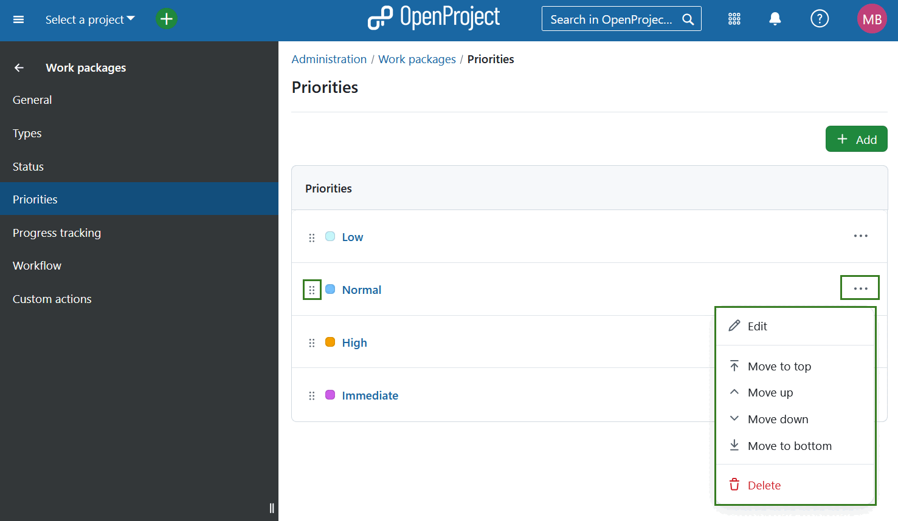

---
sidebar_navigation:
  title: Priorities
  priority: 966
description: Work package priorities in OpenProject.
keywords: work package priorities, work package configuration
---
# Work package priorities

To create or edit work package priorities in OpenProject, navigate to *Administration → Work packages → Priorities*. Here you will see all existing work package priorities. You can adjust the items within the list by using the options behind the **More (three dots)** menu on the right side. You can also rearrange the order by using the drag-and-drop handle on the left.

## Create new work package priority

To create a new work package priority, select the **+ Add** button in the top right corner.

You will then be able to name the priority, select the assigned color, and activate it. Press the **Save** button to save your changes.

## Edit or remove work package priority

To **edit** an existing priority, either click on the name of the priority directly or select the **Edit** option from the **More (three dots)** menu on the right end of the row.

To remove a work package priority, open the **More (three dots)** menu on the right end of the row and click on the **delete icon**.
