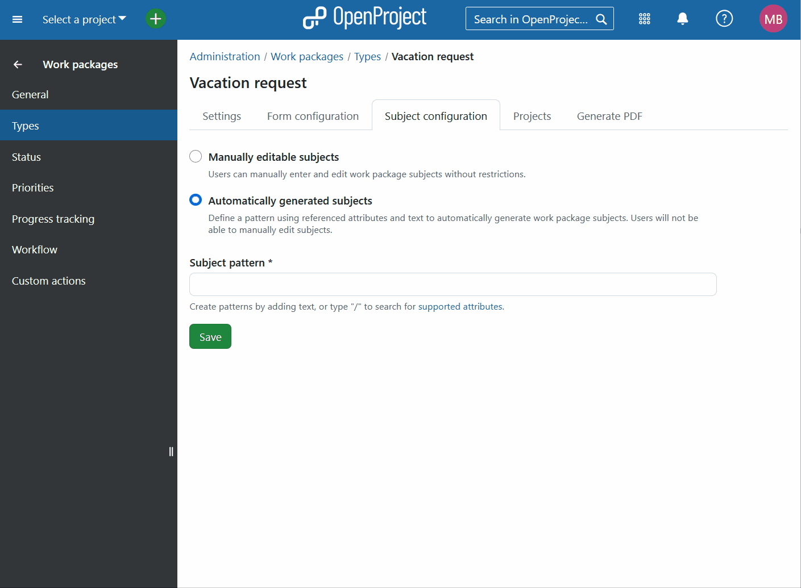

---
sidebar_navigation:
  title: Automatic subjects
  priority: 900
description: Configure automatic work package subjects in OpenProject.
keywords: work package subject, automatic subject, subject pattern
---

# Configure automatic work package subjects (Enterprise add-on)

[feature: work_package_subject_generation ]

This guide explains how administrators can configure **automatic subject patterns** for work packages in OpenProject. Please also refer to the [user guide on automatic work package subjects](../../../../user-guide/work-packages/automatic-subjects/) for more details on automatic subjects within projects. 

Subject patterns combine static text with dynamic attributes - such as dates, author names, or custom fields - to automatically generate consistent and informative work package subjects.

Automatic subject patterns help teams quickly identify tasks, reduce manual errors, and standardize naming conventions across your projects. Specific patterns can be defined for different work package types.

## How subject patterns work

A subject pattern includes a combination of:

- **Static text** (e.g., `Invoice`, `Vacation Request`)

> [!TIP]
> Use the company-approved language for static text, as it will not be translated into language users can specify for their personal accounts. 

- **Dynamic attribute placeholders** (e.g., `[Author]`, `[Start date]`, `[Custom Field: Invoice ID]`)

> [!TIP]
> Dynamic attribute placeholders will be shown in the default language defined globally for all users in your organization (under Administration -> Users and permissions -> User settings). Users can still change language settings for their personal accounts, but this will have no bearing on the automatic work package subjects. 

When users create or edit work packages, OpenProject automatically replaces these placeholders with real attribute values, generating clear subjects.

## Add, edit and delete attributes

Administrators configure subject patterns using a simple editor in the administration settings:

### How to add attributes

1. Navigate to *Administration → Work Packages → Types*, choose a type, then open **Subject configuration**.

2. Type `/` in the input field to open attribute search.

3. Search for and select an attribute from the dropdown. The chosen attribute appears as a placeholder (e.g., `[Start date]`).

> [!TIP]
> Some attributes can be selected not only for the work package in question, but also for it's parent work package.

4. Don't forget to *Save* your changes. 

### How to edit attributes

- Click into an existing attribute placeholder to edit it. This will trigger the attribute search again.
- Type and select different attributes from the dropdown list. The placeholder will update automatically.

### How to delete attributes

- Delete an attribute placeholder same as you would a regular text (e.g., using backspace).

## Supported attributes and limitations

### Work package attributes

Subject patterns can include placeholders referencing the following work package attributes:

| Attribute Name | Data Type         | Example    |
| -- | -- | - |
| Accountable    | User name         | Jon Doe    |
| Assignee       | User name         | Jon Doe    |
| Author         | User name         | Jon Doe    |
| Category       | String            | Category A |
| Created on     | Date              | 2025-01-10 |
| Finish date    | Date              | 2025-01-15 |
| ID             | Integer           | 3000       |
| Priority       | String            | Normal     |
| Project        | Project ID        | 30         |
| Remaining work | Hours (float)     | 8.0        |
| Start date     | Date              | 2025-01-12 |
| Status         | String            | New        |
| Type           | Work package type | Task       |
| Work           | Hours (float)     | 10.0       |

**Custom fields**: Supported custom fields include Text, Integer, Float, List, Date, Boolean, User, Version.
**Unsupported attributes**: Long text and Link custom fields are excluded to keep subjects concise.

> [!NOTE] 
> Ensure selected attributes are activated and available in your project and work package types to avoid showing “N/A” in subjects.

### Project attributes

| Attribute Name         | Data Type   | Example  |
| - | -- | -- |
| Project: Active        | Boolean     | true     |
| Project: Name          | String      | HR       |
| Project: Status        | Status code | on_track |
| Project: Subproject of | ID          | 123      |
| Project: Public        | Boolean     | false    |

**Custom project attributes:** Supported attributes include Integer, Float, List, Date, Boolean, User, Version.
**Unsupported project attributes**: Long text and Link custom fields are excluded to keep subjects concise.

## Update automatic subjects

Automatic subjects update whenever an attribute referenced in the **current work package** changes and the work package is saved.

> [!IMPORTANT] 
> Attributes referencing parent work packages or project attributes won't trigger immediate updates. Changes in parent or project attributes appear only when the child work package itself is updated and saved again.

## FAQs

### Why "N/A" appears in subjects

"N/A" indicates an unavailable attribute referenced in the subject pattern. Typical causes include:

- The attribute isn't activated in the current project.
- The attribute was removed from form configuration after creating the pattern.
- A parent attribute is referenced, but the parent doesn't contain the attribute.

### Why \[Attribute Name\] appears in subjects

\[Attribute Name\] indicates an empty attribute referenced in the subject pattern.

- The attribute hasn't been filled by the user.
- A parent attribute is referenced, but no parent is set.
- A project attribute is referenced, but hasn't been filled.

## Tips for effective patterns

Good subject patterns should be:

- **Concise**: Keep subjects short and readable.
- **Relevant**: Include only essential attributes needed for quick identification.
- **Descriptive**: Use clear static text (e.g., `Invoice`, `Bug Report`) to define the work package type.
- **Language choice**: Use the company-approved language for 

Check our [Example Subject Patterns](https://www.openproject.org/blog/automatically-generated-work-package-subjects/) for inspiration.
