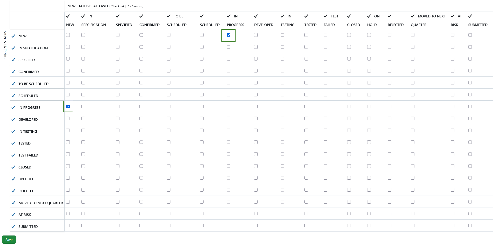
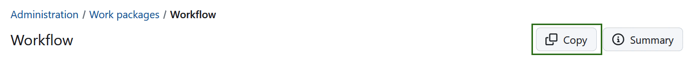
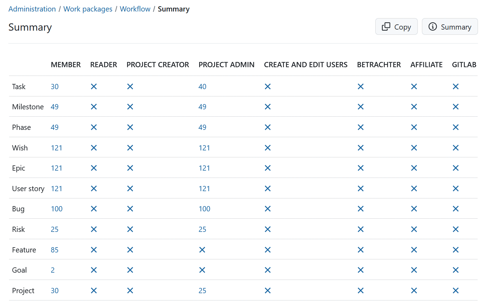

---

sidebar_navigation:
  title: Workflows
  priority: 960
description: Manage Work package workflows.
keywords: work package workflows
---

# Manage work package workflows

A **workflow** in OpenProject is defined as the allowed transitions between status for a role and a type, i.e. which status changes can a certain role implement depending on the work package type.

This means, a certain type of work package, e.g. a Task, can have the following workflows: News → In Progress → Closed → On Hold → Rejected → Closed. This workflow can be different depending on the [role in a project](../../users-permissions/roles-permissions).

## Edit workflows

To edit a workflow, first decide if you want to edit default transitions that apply to all users (depending only on the role) or for the specific cases where a user is the author or the assignee. Three tabs on top of the screen allow you to choose this:

Once you are in the right tab:

1. Select the **role** from the dropdown menu for which you want to edit the workflow.
2. Select the **work package type** from the dropdown menu for which you want to edit the workflow.
3. Check if you **only want the statuses that are used by this type** to be displayed (this option is disabled per default, but you can always activate it).
4. Click the **Edit** button.

> [!NOTE]
> If you have created a [new status](../work-package-status) and want to add it to a workflow of a certain work package type, you need to deselect this option. Only this way also status that are not (yet) used by this type will appear in the list and can be added to a workflow.

You will be able to adapt the following:

1. Adapt which status changes are allowed by the selected role for the selected work package type. The matrix shows the **current status on the Y axis (rows)** and the **new status allowed on the X axis (columns)**. Read transitions from the rows to the columns, e.g., if the cell at the intersection of **NEW (row)** and **IN PROGRESS (column)** is checked, a transition from **NEW → IN PROGRESS** is allowed.  If you want the role to be able to change statuses in **both directions** (e.g., from **NEW → IN PROGRESS** and from **IN PROGRESS → NEW**), make sure both corresponding cells are checked. In most workflows, allowing the “way back” (e.g., back from **IN PROGRESS** to **NEW**) is important so that mistakes can be corrected.
2. In addition, you can specify if this role is allowed to make specific status changes if the user who has been assigned this role also is the **author of the work package**.
3. Also you can set additional status transitions allowed if the user is the **assignee to a work package**.
4. Don’t forget to save your changes.

## Copy an existing workflow

You can copy an existing workflow by clicking **Copy** in the workflow overview.

You will then be able to determine which existing workflow should be copied to which other workflow.

## View the workflow summary

You can get a summary of the allowed status transitions of a work package type for a role by clicking on **Summary** in the workflow overview.

You will then view a summary of all the workflows. The number of possible status transitions for each type and role are shown in a matrix.

> [!TIP]
> For more examples on using workflows in OpenProject take a look at [this blog article](https://www.openproject.org/blog/status-and-workflows/).
