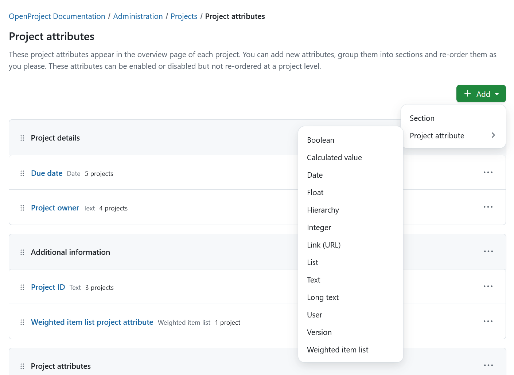
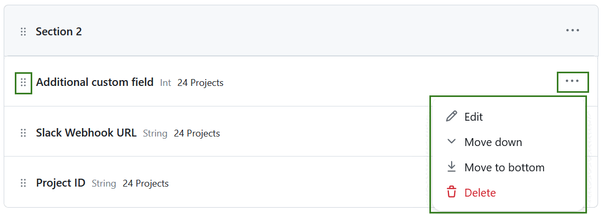
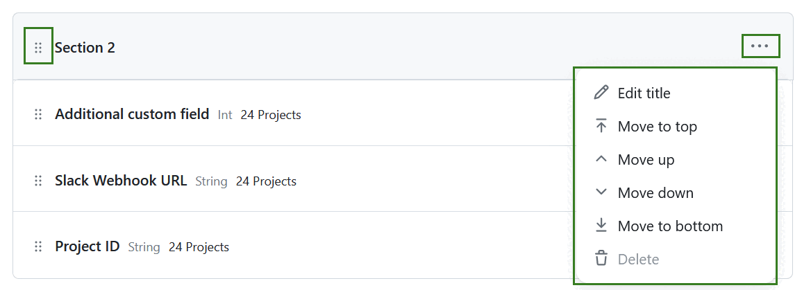

---
sidebar_navigation:
  title: Project attributes
  priority: 300
description: Viewing, creating and modifying project attributes in OpenProject
keywords: project attributes, create, project settings
---

# Project attributes

Project attributes are custom fields that allow you to communicate key information relevant to a project in the [Project Overview](../../../user-guide/project-overview) page.

> [!NOTE]
> Prior to version 14.0, these were called "project custom fields" and described under the [Custom fields](../../custom-fields/custom-fields-projects/) page. Starting with 14.0, there is now a new entry in the administration section called 'Project attributes' under 'Projects'.

This page describes how to create, order and group project attributes and is directed at instance administrators. If you want know how to enable and set the values for project attributes at a project level, please refer to the [Project Overview](../../../user-guide/project-overview) page of the user guide.

## View project attributes

To view all existing project attributes, navigate to **Administration settings** → **Projects** → **Project attributes**.

Each project attribute will be displayed in individual rows, which contain:

1. The drag handle
2. The project attribute name
3. Format
4. Number of projects using the attribute
5. More button

Attributes may also be contained in [sections](#sections).

## Create a project attribute

To create a new project attribute, click on the **+ Add** button in the top right corner, select **Project attribute** and select the project attribute format from the list of available options. 

> [!TIP]
> You cannot change the project attribute format once the project attribute is created.

You can pick from nine different types of formats: text, long text, integer, float, list, date, boolean, user and version. Depending on the chosen format, you might have additional options, such as minimum and maximum width, default value or regular expressions for validation.

This is an example of new project attribute with a format *Text*. 

- **Name**: This is the name that will be visible in the [Project Overview](../../../user-guide/project-overview) page, if the custom field is activated on that project.
- **Section:** If there are sections, you can pick where this new project attribute should appear. [Learn about sections](#sections) for more information.
- **Required for all projects**: Checking this makes this project attribute required for all projects. It cannot be deactivated at a project level.
- **Admin-only**: If you enable this, the project attribute will only be visible to administrators. All other users will not see it, even if it is activated in a project.
- **Searchable**: Checking this makes this project attribute (and its value) available as a filter in project lists.

## Project attribute formats

There are multiple format options for project attributes in OpenProject. You can select one of the following formats:

- **Boolean** - creates a project attribute, that is either true or false. It is represented by a checkbox that can be checked or unchecked.
- **Calculated value** (Enterprise add-on) - creates a project attribute that enables automatic computations based on formulas using numeric project attributes, for example from **Weighted item lists**.
- **Date** - creates a project attribute,, which allows selecting dates from a date picker.
- **Float** - creates a project attribute for rational numbers.
- **Hierarchy (Enterprise add-on)** -  creates a project attribute, which allows selecting one or multiple items from a hierarchical list structure. The structure can be created in the *Items* tab of the project attribute.
- **Integer** - creates a project attribute for integers.
- **Link (URL)** - creates a project attribute for URLs.
- **List** - creates a project attribute with flat list options. 
- **Text** - creates a project attribute in text format with the specified length restrictions.
- **Long text** - creates a project attribute for cases where longer text needs to entered.
- **User** - creates a project attribute, which allows selecting users that are allowed to access the entity containing the project attribute.
- **Version** - creates a project attribute, which allows selecting one or multiple versions. Versions are created on the project level in *Backlogs* module.
- **Weighted item list (Enterprise add-on)** - creates a project attribute similar to the *Hierarchy* type, but with underlying numerical values used for project evaluation (e.g., **calculated values project attributes**. Please keep in mind that **weighted item lists** custom fields can't be used as multi-select.  

### Hierarchy project attribute (Enterprise add-on)

[feature: custom_field_hierarchies ]

Project attributes of the **Hierarchy** type function in the same way as work package custom fields of the **Hierarchy** type. For detailed information, please refer to [Work package custom fields documentation](../../custom-fields/#hierarchy-custom-field-enterprise-add-on).

### Weighted item list project attribute (Enterprise add-on)

[feature: weighted_item_lists ]

Weighted item list project attributes function similarly to the **Hierarchy** type. They let you define a structured list of items arranged in a hierarchy for users to choose from.

To set up a project attribute of the **Weighted item list** type, follow the same procedure as when adding a standard project attribute and select the Weighted item list option.

Adding and modifying items within a weighted item list works in the same way as for a hierarchy project attribute.

In contrast to Hierarchy, items in a weighted item list do not include a Short value but instead require a Weight.

This numeric value is required and can be used in calculations — for example, within a project attribute of type Calculated value

### Calculated value project attribute (Enterprise add-on)

[feature: calculated_values ]

**Calculated values** enable automatic computations based on formulas using numeric project attributes, including scores from Weighted item lists or even other calculated values. The computed result is displayed directly on the project overview and in the project list. It automatically updates whenever one of its source attributes (e.g., Benefit or Effort in the example below) is changed. This allows teams to calculate project scores and prioritise consistently across the portfolio.

To set up a project attribute of the **Calculated value** type, follow the same procedure as when adding a standard project attribute and select the *Calculated value* option. Define the name, section it will appear in and the calculation formula. 

In the example below, a project attribute called **Initiative score (calculated)** is determined by this formula: (Strategic fit * 0.4) + ( User benefit* 0.4) - (Effort * 0.2).

## Modify project attributes

You can edit existing attributes under **Administration settings** → **Projects** → **Project attributes**.

Click on the  More icon to the right of each project attribute to edit, re-order or delete a project attribute.

> [!CAUTION]
> Deleting a project attribute will delete it and the corresponding values for it from all projects.

You can also use the drag handles to the left of each project attribute to drag and drop it to a new position.

> [!NOTE]
> Project admins can chose to enable or disable a project attribute from their project, but they cannot change the order. The order set in this page is the order in which they will appear in all projects.

## Enable project attributes

Under **Administration settings** → **Projects** → **Project attributes** select the *More* menu and select *Edit* or simply clicking on the name of the project attribute. This will open a detailed view of the project attribute you selected. 

The *Details* tab will allow you to edit the name, section and visibility. 

The *Projects* tab will show a list of all the projects this project attributes was activated in. 

You can remove a project attribute from a specific project by selecting the **More** menu at the end of the line and clicking the *Remove from project* option.

To add this project attribute to a specific project click the **+Add projects** button. A modal will appear allowing you to search for projects to add this project attribute into. Please note, that the projects, in which the project attribute is already activated will be shown disabled in that selection. You can include subprojects. 

> [!NOTE]
>
> It is not possible to add or remove a project attribute, if a project attribute is set to be required.

## Sections

You can create a new section click the **+ Add** button in the top right corner and select **Section**. 

Name the section and save it. 

You can group project attributes into sections to better organize them. Either drag and drop project attributes into a section or create new ones directly within a section by clicking **+Project attribute** button (only visible if a section is empty).

You can click on more icon to the right of each section to rename it, delete it or change its order.

> [!TIP]
> A section can only be deleted if no project attributes were assigned to it.

You can drag any existing project attribute into a section to move it there. You may also drag and drop entire sections up and down to re-order them.

> [!TIP]
> If a project attribute belongs to a section, it will be displayed within that section in _all_ projects.

