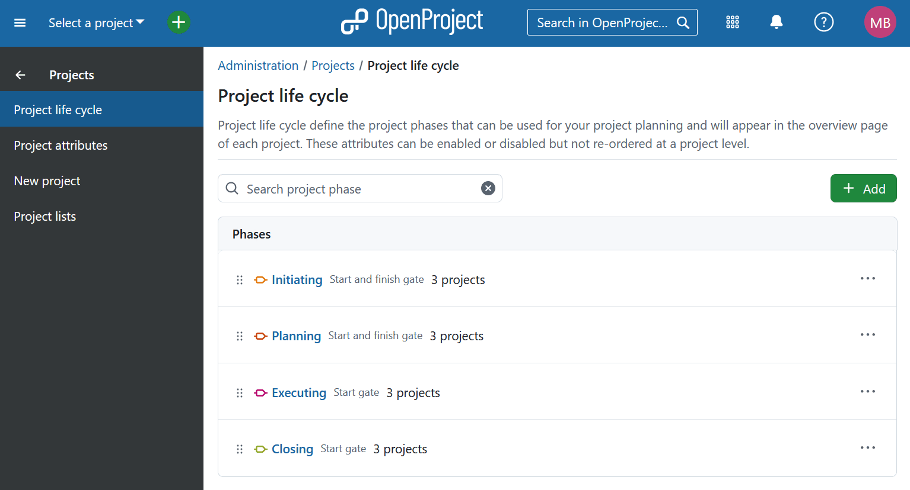
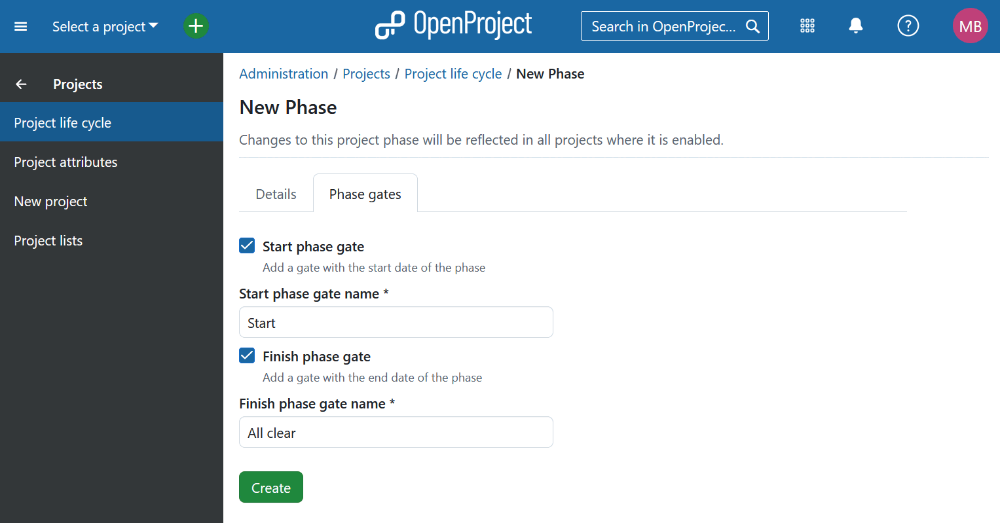

---
sidebar_navigation:
  title: Project life cycle
  priority: 400
description: Viewing, creating and modifying project phases and gates in OpenProject
keywords: project life cycle, project phase, project phase gate, project settings
---

# Project life cycle

## Overview

The *Project life cycle* feature allows organizations to define and visualize structured project phases across all projects and portfolios. This makes it easier to:

- Track the current stage of any project at a glance
- Understand portfolio-level progress
- Support decision-making and project governance

Each life cycle consists of multiple **project phases**, and each phase can optionally include **start** and **finish phase gates**. These help mark formal checkpoints within your project’s timeline.

Project phases appear in the **overview page** of each project, helping teams clearly communicate project progress.

Existing projects created before the life cycle feature is enabled will not automatically have project phases or gates enabled. New projects will also have this feature disabled by default — you must manually enable it for each project after setup.

> [!NOTE]
>
> While project phases and gates can be customized globally in system administration, they **cannot** be modified per individual project, only enabled or disabled.

By default, OpenProject includes four standard project phases:
- **Initiating**
- **Planning**
- **Executing**
- **Closing**

These four stages, based on the [PM² framework](https://www.openproject.org/pm2/) are created on the global level and available for all installations. Adding new phases or editing existing ones is an Enterprise add-on. 

## Manage project phases (Enterprise add-on)

[feature: customize_life_cycle ]

To manage project phases and gates, navigate to:  *Administration → Projects → Project life cycle*.

Each phase can have a **start gate** and/or a **finish gate**, which are optional and configurable.

### Reorder phases

Project phases are listed in order of execution. You can rearrange the order of the phases within **system administration**:

- Use **drag and drop** to move phases into the desired order

- Or click the **More** menu (three dots icon) and select **Move up** or **Move down**

  

> [!NOTE]
>
> The order of project phases is **system-wide** and cannot be changed per project.

### Add a project phase 

To add a new project phase go to *Administration → Projects → Project life cycle* and click the **+ Add** button. You can then enter a name for the new phase and choose a color to visually distinguish the phase. Click **Create**. 

### Add a phase gate

After creating the phase or while setting one up, navigate to the *Phase gate* tab and activate and name start and/or finish phase gates. 

### Edit a project phase

To modify an existing project phase:

- Click the phase name directly, or
- Click the More menu (three dots icon) next to the phase and choose *Edit*

To edit the gates associated with a phase, switch to the Phase gate tab and make the necessary adjustments.

### Delete a project phase

To delete an existing project phase click the More menu (three dots icon) next to the phase and choose *Delete*.

