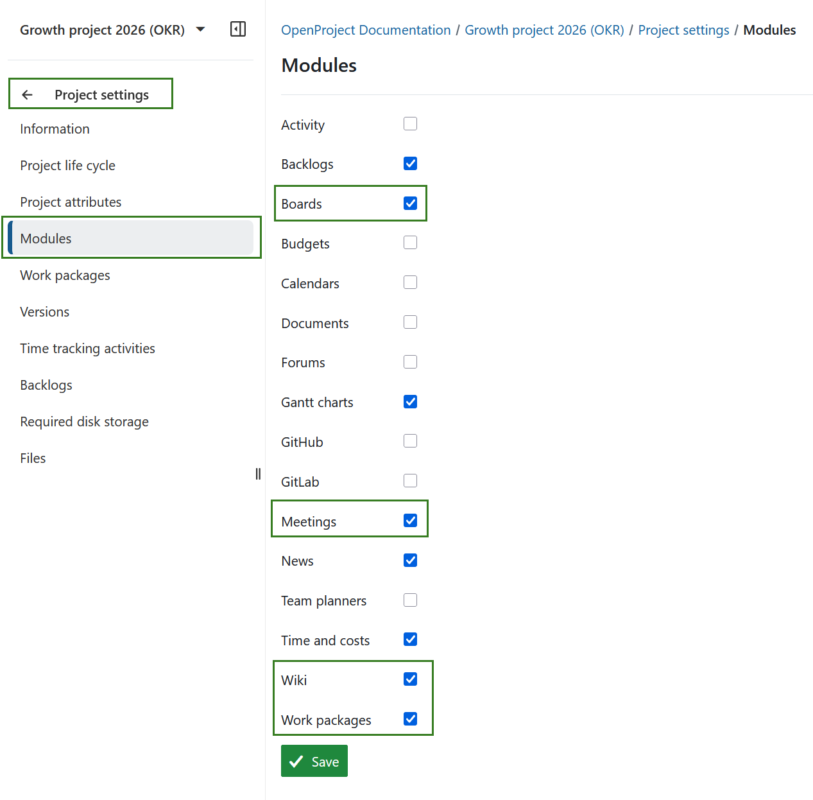
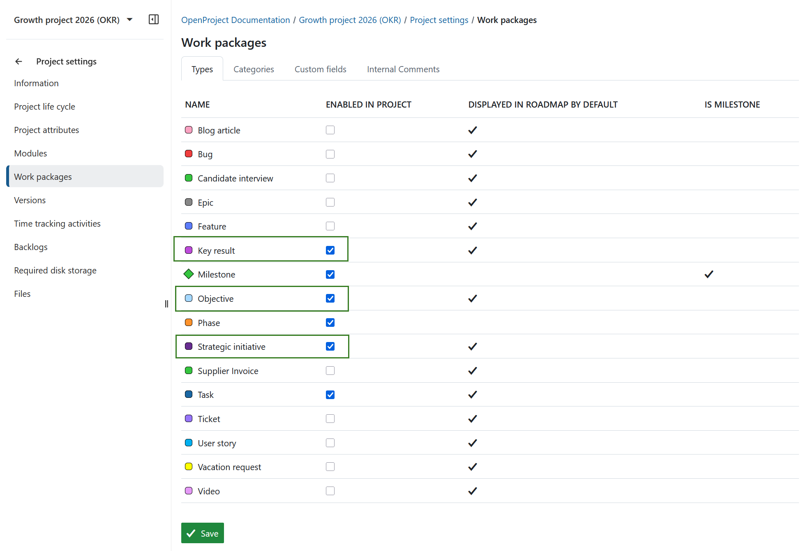
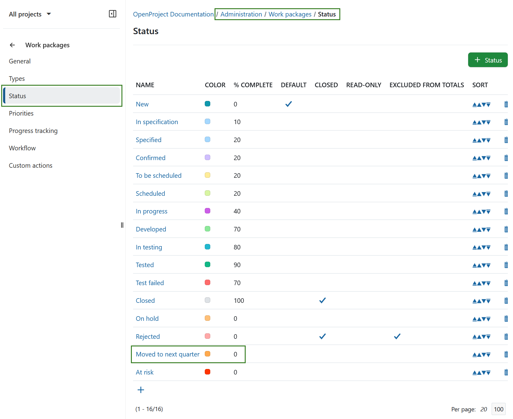
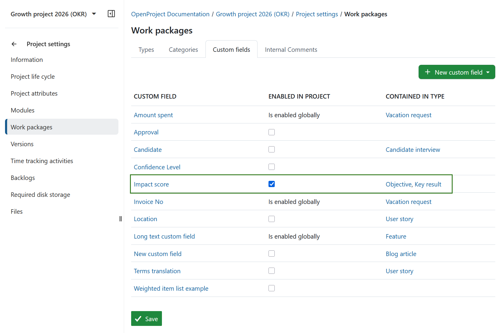
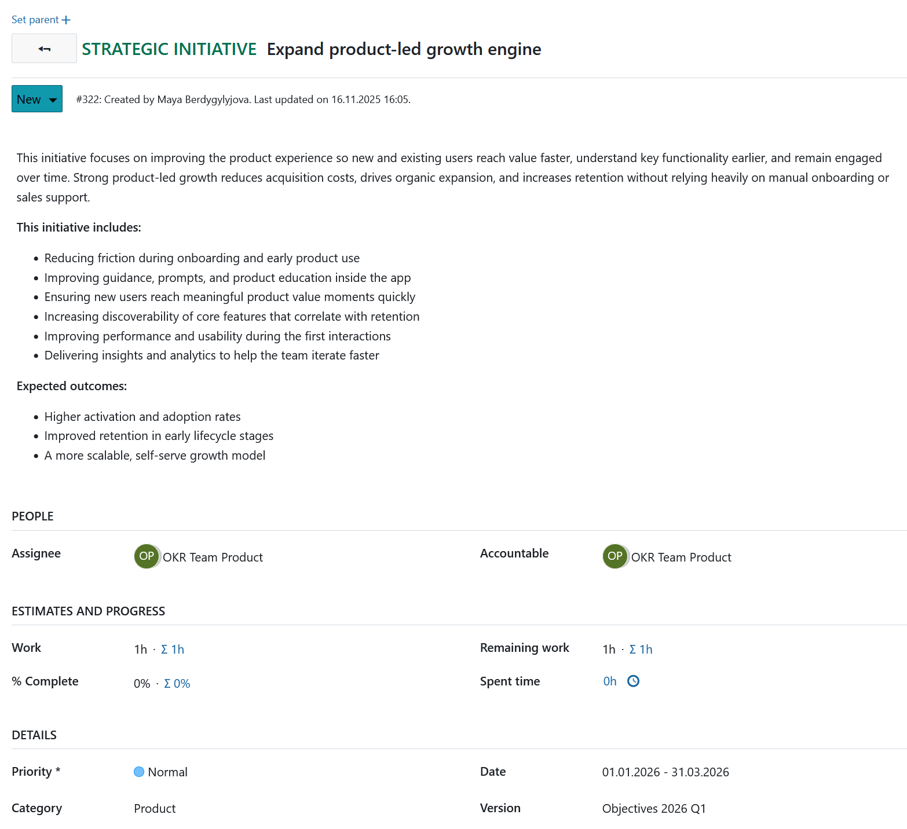
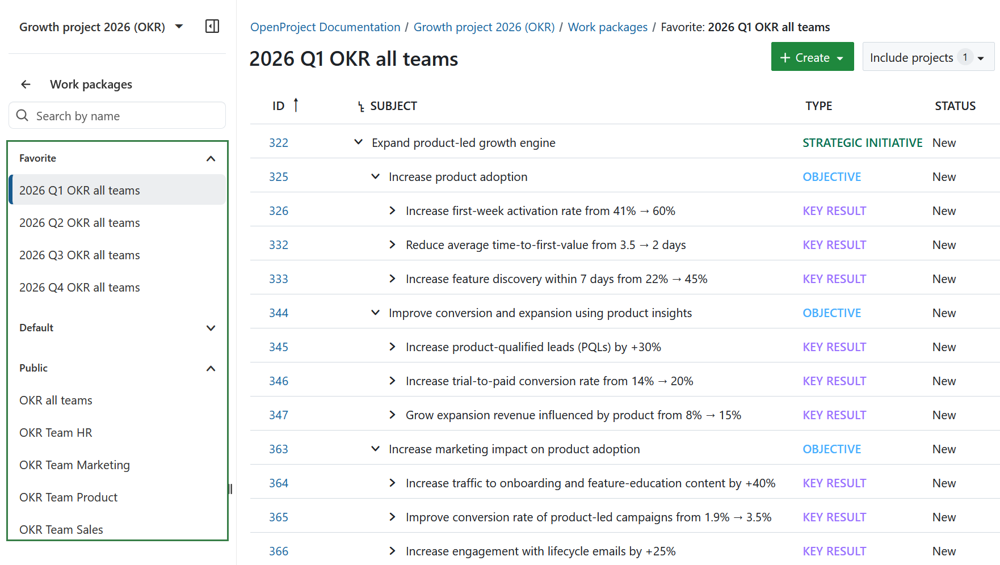
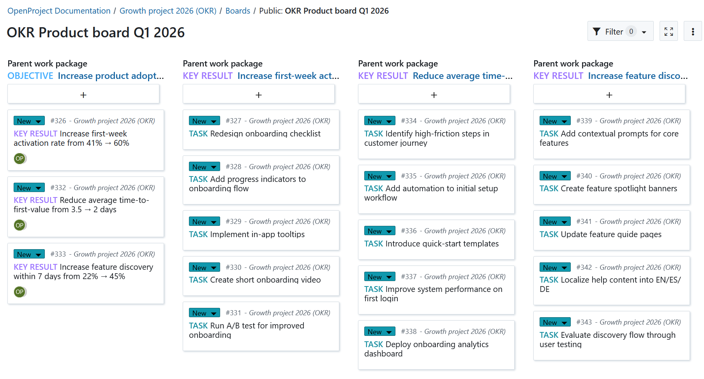
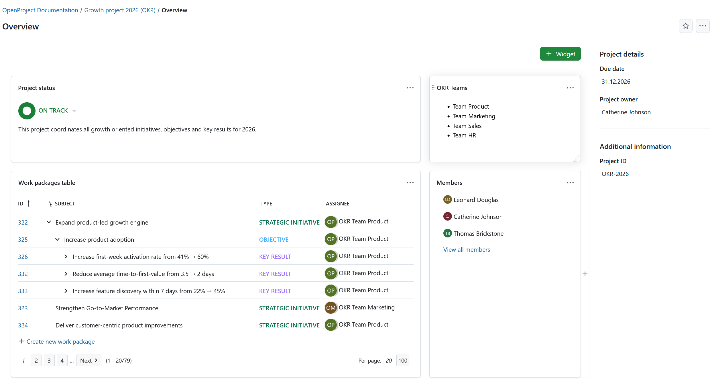
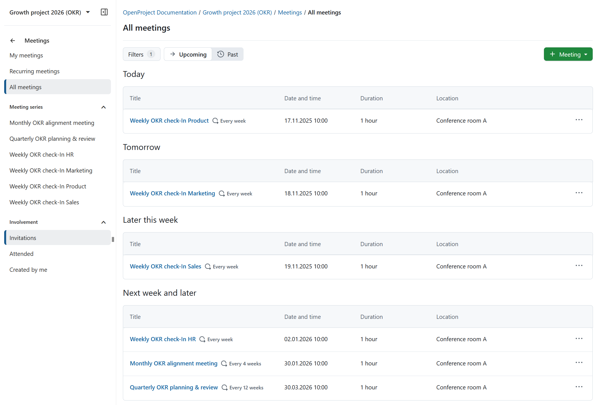

---
sidebar_navigation:
  title: OKR management
  priority: 995
description: OKR management in OpenProject
keywords: OKR, objective, key result, use case, use-case, objectives and key results, strategic initiative
---

# OKR management with OpenProject

## Introduction
The **Objectives and Key Results (OKR)** framework helps organizations align strategic goals with measurable outcomes. 
By managing OKRs in OpenProject, teams can connect high-level strategy with day-to-day execution in a transparent and collaborative way.

This use case describes how to structure, monitor, and review OKRs in OpenProject — following the approach successfully implemented by the OpenProject team.

## Before you start
### Define roles

Before configuring your OKR project, make sure that **appropriate [roles and permissions](../../system-admin-guide/users-permissions/)** are set up in OpenProject.

Use clear, logical names and ensure that each role has the necessary permissions — for example, the ability to manage work package types, versions, and custom fields, if you plan to tailor the OKR configuration.

You may want to introduce a few OKR-specific roles — for example, someone who facilitates the OKR process, someone who owns Objectives, or someone responsible for maintaining progress updates.
These role names and responsibilities can be adapted based on your organizational structure.

> [!TIP]
> Keep roles lightweight and goal-focused. It’s more important that responsibilities are clear than that the role names are perfect.

### Set up a Knowledge Hub

Create a **dedicated [project wiki](../../user-guide/wiki/)** to serve as the central Knowledge Hub for your OKR methodology.
This ensures all team members, including new ones, understand how OKRs are written, measured, and reviewed.

Use it to document:
- OKR writing guidelines
- Templates and checklists
- Process documentation
- Terminology and responsibilities
- Anything else that your team should be aware of.

A centralized Knowledge Hub ensures consistency, reduces onboarding time, and supports a shared understanding of how OKRs operate across the organization. Here is an example of such a Knowledge Hub.

## 1. Set up an OKR project

[Create a **dedicated OKR project**](../../getting-started/projects/#create-a-new-project) in OpenProject. 
Separating OKRs from other projects ensures that strategic goals and progress remain clearly visible across all quarters.

Before setting up your OKRs, ensure the following modules are activated in your project:

-  Work Packages
-  Boards
-  Meetings
-  Wiki

### Recommended project configuration
1. Define dedicated **[work package types](../../system-admin-guide/manage-work-packages/work-package-types/)** that reflect the OKR hierarchy:

- *Strategic Initiative* 
- *Objective* 
- *Key Result* 
- *Task*

These types connect strategic goals to measurable results and operational activities. Don't forget to [activate these work package types in your project settings](../../user-guide/projects/project-settings/work-packages/#work-package-types). 

2. Use standard **statuses** such as *New*, *In progress*, and *Closed*. Optionally, [add a new work package status](../../system-admin-guide/manage-work-packages/work-package-status/#create-a-new-work-package-status), for example *Moved to next quarter* to carry unfinished Objectives or Key Results into the following cycle.

   

3. Create **[versions](../../user-guide/projects/project-settings/versions/)** (e.g., *Objectives 2026 Q1*) to represent quarterly OKR cycles.

   

4. Configure **[groups](../../system-admin-guide/users-permissions/groups/)** or teams to assign OKRs to responsible departments or cross-functional groups.

   

> [!TIP]
> Use one continuous OKR project. 
> Create a new version for each quarter — this saves time in future cycles, keeps previous OKRs accessible, and makes it easy to move Key Results into the next quarter if priorities change.

### Optional configuration
To make the OKR framework your own, you can add **[custom fields](../../user-guide/projects/project-settings/work-packages/#work-package-custom-fields)** that capture information important to your organization.

One useful example for such a custom field is the **Impact score**, i.e. the rate for the potential impact of each Objective or Key Result on a scale of 1–5. 
This helps teams prioritize OKRs based on strategic value. For instance:

| Value | Meaning |
  |-------|---------|
  | 1     | Minor improvement or maintenance activity |
  | 3     | Noticeable progress toward team or departmental goals |
  | 5     | High-impact initiative contributing directly to company strategy |

Regularly updating these fields during check-ins allows you to see which OKRs are most critical and track how priorities evolve over time.  Feel free to experiment with other fields to fit your company’s specific OKR needs.

## 2. Define the OKR structure

After configuring your project, define your actual **Strategic Initiatives, Objectives, and Key Results** for the upcoming quarter.

### Hierarchical structure
Use **[work package relations](../../user-guide/work-packages/work-package-relations-hierarchies/)** to represent dependencies:
- *Strategic Initiatives* at the top level 
- *Objectives* linked beneath each initiative 
- *Key Results* with respective *Tasks* as children of the relevant Objective 

This hierarchy maintains traceability between daily actions and strategic priorities. 

### Attributes and descriptions
For each work package:
- Set **start and finish dates** aligned with the quarter. 
- Assign the relevant **version** (e.g., *Q1 2026*). 
- Define **priority** and add clear descriptions. 
- Use **progress** or **work estimate** fields to quantify progress where relevant.

## 3. Monitor progress

Track OKR progress continuously using OpenProject’s work package tables, boards, and overview pages.

### Work package tables
Use saved **[work package tables](../../user-guide/work-packages/work-package-views/)** to filter OKRs by quarter, team, or Strategic Initiative — for example:
- A management overview of all Strategic Initiatives across quarters. 
- A team-specific view for quarterly Objectives (e.g., “2026 Q1 OKR all teams”).

### Boards
Use **[parent–child boards](../../user-guide/agile-boards/)** to visualize Objectives alongside their Key Results and supporting Tasks. This view works well for weekly or bi-weekly OKR check-ins to review progress and identify blockers.

### Overview and statistics
Open the **[Project overview](../../user-guide/project-overview/)** page to see an aggregated summary of OKR Initiatives, Objectives, Key Results and Tasks. 

Combine this with saved filters to create a simple management dashboard.

## 4. Facilitate communication

Maintain regular communication to keep OKRs relevant and aligned. 
OpenProject provides collaboration tools for structured and transparent OKR discussions.

### Meetings
Use the **[Meetings module](../../user-guide/meetings/)** to plan and conduct recurring OKR sessions. Create a meeting template to standardize the review process:

- Add Objectives and Key Results directly to the agenda. 
- Record progress and identify blockers during the meeting. 
- Capture outcomes linked to related work packages. 

All participants receive invitations automatically, and meeting notes remain available for later reference – in OpenProject and as PDF downloads.

Read more about [meeting management](../meeting-management/) for more insights on structuring meetings.

> [!TIP] 
>
> Nominate one or more **OKR masters** to coordinate the process. They help teams define measurable OKRs, ensure consistency across departments, and facilitate the review meetings.

### Check-ins and reviews
We recommend to begin with **weekly OKR check-ins** when introducing the framework, then move to **bi-weekly or monthly** sessions as teams gain experience. 
Use these meetings to update Impact Scores, review outcomes, and adjust priorities as needed.

## 6. Outcome
After completing this setup, you will have a structured OKR project in OpenProject that links strategic goals with measurable results. 
Teams can view their Objectives and Key Results in one workspace, monitor progress in real time, and use regular meetings to stay aligned on priorities each quarter.

---

## Summary
OpenProject provides a flexible and transparent environment for managing Objectives and Key Results — from strategic planning to operational review. 
By combining structured work packages, boards, meetings, and an internal knowledge hub, teams can align strategy and execution efficiently within one workspace.

Every organization works differently. For more insights into how the OpenProject team manages OKRs internally, see this blog post on [how we use OpenProject for OKR management in our team](https://www.openproject.org/blog/okr-software-use-case/).

Treat your OKR setup as an evolving process — **adapt and iterate** your configuration to match your company’s rhythm, reporting needs, and level of maturity.