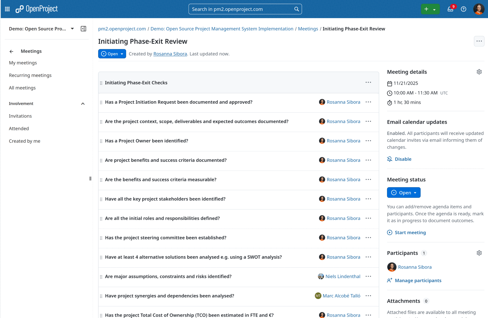
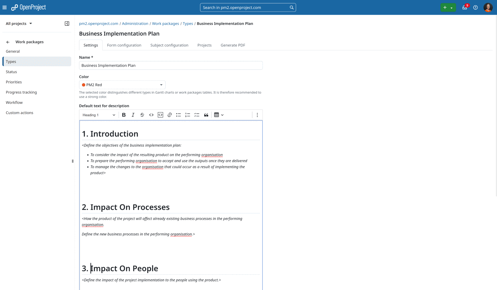
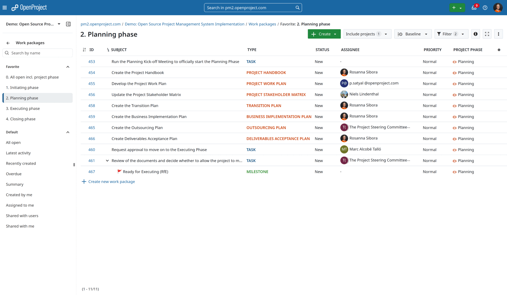
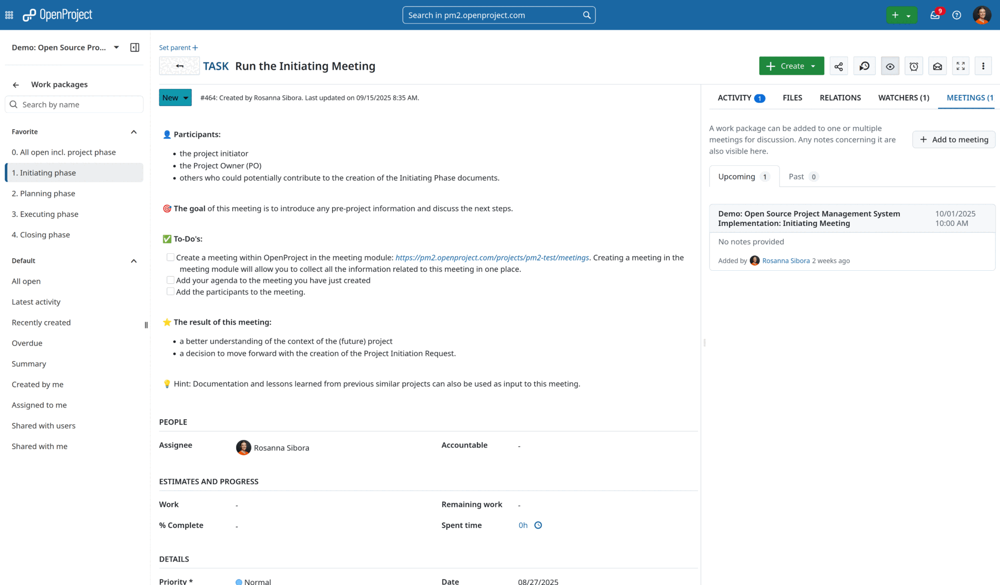
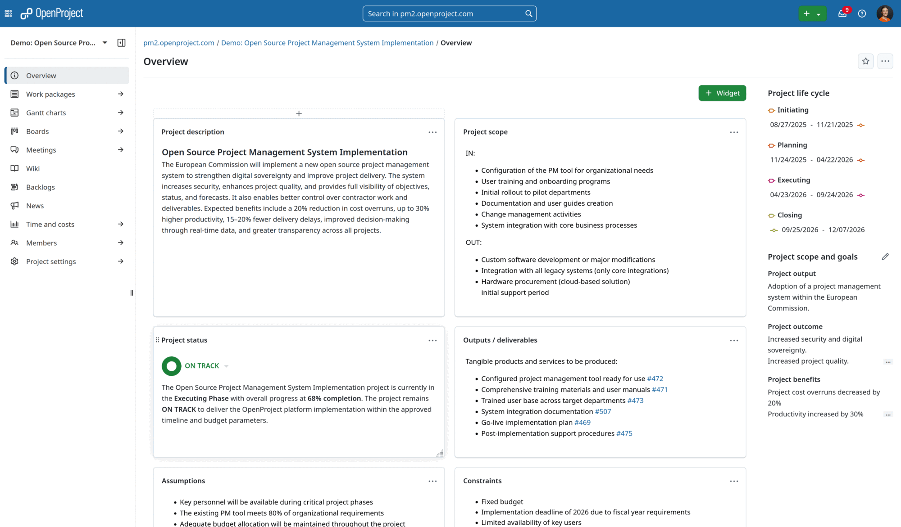

---
sidebar_navigation:
  title: PM² and PMflex project management
  priority: 985
description: Learn how to set up and configure OpenProject to support the PM²/PMflex methodology with OpenProject
keywords: pmflex, PM², PM2, 

---

> [!NOTE]
>
> OpenProject is continuously enhanced with every monthly release to better support project management. Teams using PM² and PMflex also benefit from this continuous stream of automation and UX improvements. This use case description is updated with each release, incorporating feedback from the PM² Community.

# Implementing PM² and PMflex project management in OpenProject

OpenProject is a powerful project management tool that provides excellent support for the [PM² methodology](../../project-management-guide). PM² is the official project management methodology of the European Commission. It is designed as a light and easy-to-implement framework, which project teams can tailor to their specific needs.

[PMflex](https://www.bva.bund.de/DE/Services/Behoerden/Beratung/BZB/Themenwelten/Strategie/Projektmanagement/PMflex/pmflex_node.html) is an extension of the PM² Project Management Methodology developed and maintained by the [Federal Office of Administration (BVA)](https://www.bva.bund.de/EN/Home/home_node.html). It complements PM² by providing additional guidance, templates, and best practices to adapt the methodology and targets German federal authorities and other public-sector bodies.

Project teams who choose to implement the **PM²** or **PMflex** methodology can leverage the wide range of features and customizability that OpenProject offers in order to effectively support PM² implementation during the whole project life cycle.

## Structure and terminology

The PM² methodology and terminology align very well with the structure of OpenProject. The implementation of project phases is based on PM²’s four sequential phases (Initiating, Planning, Executing, Closing). These can, of course, be adapted to fit the specific needs of each organization.

This table provides an overview of the key terms and structures used to **map** PM² in OpenProject. It also includes links to the detailed user guide with further information in the PM² Guide.

| PM² and PMflex terminology                                   | OpenProject terminology                          | Examples with demo data                                      | Potential product iteration                                  |
| ------------------------------------------------------------ | ------------------------------------------------ | ------------------------------------------------------------ | ------------------------------------------------------------ |
| [1 An Introduction to the PM² Guide](../../project-management-guide/1-introduction) |                                                  |                                                              |                                                              |
| -                                                            |                                                  |                                                              |                                                              |
| [2 Project Management](../../project-management-guide/2-project-management) |                                                  |                                                              |                                                              |
| PM² Project                                                  | [Project](../../user-guide/projects/)            | [Demo project](https://pm2.openproject.com/projects/pm2-test) | [#67001](https://community.openproject.org/wp/67001) Create seeded PM² projects at runtime |
| Phase Gate                                                   | Phase gate within project life cycle             | [Demo project](https://pm2.openproject.com/projects/pm2-test) | [#65838](https://community.openproject.org/wp/65838) Show phase gates as separate columns in the project list |
| [3 Overview of the PM² Methodology](../../project-management-guide/3-overview-pm2) |                                                  |                                                              |                                                              |
| PM² Project Lifecycle                                        | Project life cycle                               | Sidebar of [Project overview](https://pm2.openproject.com/projects/pm2-test) | [#67003](https://community.openproject.org/wp/67003) Project timeline widget showing phases and gates on the project overview |
| [4 Project Organisation and Roles](../../project-management-guide/4-project-organisation-and-roles) |                                                  |                                                              |                                                              |
| Project Roles                                                | Project members with roles                       | [Members](https://pm2.openproject.com/projects/pm2-test/members) | [#31411](https://community.openproject.org/wp/31141) Add PM² roles and permissions to seed data |
| [5 Initiating Phase](../../project-management-guide/5-initiating-phase) |                                                  |                                                              |                                                              |
| Project Charter                                              | Project Charter (work package type)              | [Project Charter](https://pm2.openproject.com/projects/pm2-test/work_packages/451) | [#68064](https://community.openproject.org/wp/68064) Beyond documents for project artefacts |
| Project Initiation Request                                   | Project Initiation Request (work package type)   | [Project Initiation Request](https://pm2.openproject.com/projects/pm2-test/work_packages/449) | [#68854](https://community.openproject.org/wp/68854) Multi-step project creation wizard to create and process PM²/PMflex project initiation requests **Release info**: first version will be shipped in [17.0](https://community.openproject.org/wp/67801) behind a feature flag - general availability starting with [17.1](https://community.openproject.org/wp/69276). |
| Business Case                                                | Business Case (work package type)                | [Business Case](https://pm2.openproject.com/projects/pm2-test/work_packages/450) | [#68064](https://community.openproject.org/wp/68064) Beyond documents for project artefacts [#67726](https://community.openproject.org/wp/67726) Project business case widget for project overview |
| Phase Gate RfP (Ready for Planning)                          | Phase Gate                                       |                                                              |                                                              |
| [6 Planning Phase](../../project-management-guide/6-planning-phase) |                                                  |                                                              |                                                              |
| Project Work Plan                                            | Project Work Plan (work package type)            | - [Create project work plan](https://pm2.openproject.com/wp/455) - [Project Work Plan](https://pm2.openproject.com/projects/pm2-test/work_packages?query_id=69) | [#68528](https://community.openproject.org/wp/68528) PDF export of PM²/PMflex artefacts |
| Project Handbook                                             | Project Handbook (work package type)             | [Project Handbook](https://pm2.openproject.com/wp/454)       | [#68064](https://community.openproject.org/wp/68064) Beyond documents for project artefacts |
| Deliverables Acceptance Plan                                 | Deliverables Acceptance Plan (work package type) | [Deliverables Acceptance Plan](https://pm2.openproject.com/wp/466) | [#68528](https://community.openproject.org/wp/68528) PDF export of PM²/PMflex artefacts |
| Outsourcing Plan                                             | Outsourcing Plan (work package type)             | [Outsourcing Plan](https://pm2.openproject.com/wp/465)       | [#68528](https://community.openproject.org/wp/68528) PDF export of PM²/PMflex artefacts |
| Business Implementation Plan                                 | Business Implementation Plan (work package type) | [Business Implementation Plan](https://pm2.openproject.com/wp/459) | [#68528](https://community.openproject.org/wp/68528) PDF export of PM²/PMflex artefacts |
| Project Stakeholder Matrix                                   | Project Stakeholder Matrix (work package type)   | [Project Stakeholder Matrix](https://pm2.openproject.com/wp/456) | [#68058](https://community.openproject.org/wp/68058) Stakeholder module to list all relevant project stakeholder |
| Project Work Plan                                            | Project Work Plan (work package type)            | [Project Work Plan](https://pm2.openproject.com/wp/455)      | [#68064](https://community.openproject.org/wp/68064) Beyond documents for project artefacts |
| Transition Plan                                              | Transition Plan (work package type)              | [Transition Plan](https://pm2.openproject.com/wp/458)        | [#68528](https://community.openproject.org/wp/68528) PDF export of PM²/PMflex artefacts |
| Phase Gate: RfE (Ready for Executing)                        | Phase Gate                                       |                                                              |                                                              |
| [7 Executing Phase](../../project-management-guide/7-executing-phase) |                                                  |                                                              |                                                              |
| Executing Kick-off Meeting                                   | Meeting                                          |                                                              |                                                              |
| Phase Gate: RfC (Ready for Closing)                          | Meeting                                          |                                                              |                                                              |
| [8 Closing Phase](../../project-management-guide/8-closing-phase) |                                                  |                                                              |                                                              |
| Project-End Report                                           | Project-End Report (work package type)           | [Project-End Report](https://pm2.openproject.com/wp/502)     | [#68064](https://community.openproject.org/wp/68064) Beyond documents for project artefacts |
| Quality Review Report                                        | Quality Review Report (work package type)        | [Quality Review Report](https://pm2.openproject.com/wp/487)  | [#68528](https://community.openproject.org/wp/68528) PDF export of PM²/PMflex artefacts |
| [9 Monitor & Control](../../project-management-guide/9-monitor-and-control) |                                                  |                                                              |                                                              |
| Risk log                                                     | Work package                                     | [Risk log](https://pm2.openproject.com/projects/pm2-test/work_packages?query_id=91) | [#38012](https://community.openproject.org/wp/38012) Risk module |
| Project Status Report                                        | Project Status Report (work package type)        | [Project Status Report](https://pm2.openproject.com/wp/483)  | [#30528](https://community.openproject.org/wp/30528) Project status reporting module |
| Change Request                                               | Change Request (work package type)               | [Change Request](https://pm2.openproject.com/wp/481)         |                                                              |
| Approval                                                     | Approval (work package type)                     | [List of approvals](https://pm2.openproject.com/projects/pm2-test/work_packages?query_id=67) | [#49426](https://community.openproject.org/wp/49426) Review and approval vote for work packages |
| Meeting                                                      | Meeting (module within OpenProject)              | [Ready for planning meeting](https://pm2.openproject.com/projects/pm2-test/meetings/2) | [#35642](https://community.openproject.org/wp/35642) Provide templates for meeting agendas [#67059](https://community.openproject.org/wp/67059) Copy meeting agendas when creating a project based on a template [#68050](https://community.openproject.org/wp/68050) Link meetings with phase gates [#68052](https://community.openproject.org/wp/68052) Link work packages with phase gates |
| [Appendices](../../project-management-guide/appendices)      |                                                  |                                                              |                                                              |
| [PM² Artefacts](../../project-management-guide/appendices/#e-1-pm-artefacts--activities-summary-tables-and-diagrams) | Custom work package types                        | [List of all PM² artefacts](https://pm2.openproject.com/projects/pm2-test/work_packages?query_id=68) | [#66309](https://community.openproject.org/wp/66309) Live-collaboration for documents [#68064](https://community.openproject.org/wp/68064) Beyond documents for project artefacts [#68528](https://community.openproject.org/wp/68528) PDF export of PM²/PMflex artefacts |

## Current development and next steps

[Product roadmap and feature backlog](https://community.openproject.org/projects/openproject/work_packages?query_id=7190)

## FAQ

### How to setup a PM² project in OpenProject?

OpenProject is your go-to product, which enables a successful implementation of PM² methodology.

Each PM² project is established as an individual OpenProject project, incorporating the PM²-specific roles. Projects can be configured with:

+ **Project members** assigned to specific PM² roles (Project Owner, Business Manager, Project Manager, Project Steering Committee etc.)
+ **Project life cycle / phases** to split projects into the four sequential and non-overlapping PM² project life cycle phases
+ **Custom work packages** to mirror the PM²-specific artefacts (e.g. Business Case, Project Handbook etc.) incl. official PM² artefacts templates
+ **Gantt charts** for giving you a visual timeline of your PM² project
+ **Meetings module** to help you prepare meetings (incl. agenda, reference to work packages) and collect all meeting-relevant information in one place

### How to use project templates to quickly setup new PM² projects?

You can also use **[project templates](https://www.openproject.org/docs/user-guide/projects/project-templates)** to make it easier to create new PM² projects with the same structure, set of enabled modules or **custom work package templates**. We highly recommend using **project templates** for standardizing PM² project setup across the organization. This will also help you guide users who are new to PM² methodology. Once a new PM² project is created using a template, it can then be modified in any way in order to allow the tailoring of the methodology.

### How to setup and manage PM² phases?

OpenProject's **project life cycle** effectively represents PM² phases and their associated **phase gates** (Ready for Planning, Ready for Executing, Ready for Closing). You can setup the four sequential, non-overlapping phases and their associated **phase gates** in the project settings.

### How to successfully pass the phase gates?

At the end of each phase, the project undergoes a review and approval process. This ensures that the project is reviewed by the relevant individuals, such as the Project Manager (PM), Project Owner (PO) or Project Steering Committee (PSC), before moving on to the next phase. These checkpoints improve the quality of project management and enable the project to proceed in a more controlled way.

The three PM² phase gates are:
• **RfP (Ready for Planning)**: at the end of the Initiating Phase
• **RfE (Ready for Executing)**: at the end of the Planning Phase
• **RfC (Ready for Closing)**: at the end of the Executing Phase.

To conduct the approval process we suggest to use work packages in combination with the meeting module. Create a work package and a corresponding meeting, Use the phase-exit checklist to evaluate the readiness for the next project phase.

### How to create and share PM² artefacts with OpenProject?

PM² methodology includes specific **deliverables** that can be managed through OpenProject's custom work packages. To do so, create custom work packages for PM² artefacts like Project Charter, Business Case, Project Work Plan etc. 

While creating work packages add the official templates as pre-filled description of the newly created work package types. Whenever a user will create a new artefact using the work package, the template will be automatically visible and needs only to be filled out with relevant project data. 

Since all artefacts can be stored directly within work packages, OpenProject is your single source of truth providing all relevant project information. Everyone from the team can always access the current version of artefacts. 

If you want to be up to date with all changes within certain artefacts, e.g. Project Handbook, just add your name to the watchers list and thanks to e-mail notifications you will never miss an update. 

### How to get an overview over tasks within each phase?

OpenProject provides multiple views for managing PM² project work effectively.

**Table view:**  

* Tabular display of all project artefacts and deliverables
* Customizable sorting, grouping, and filtering by PM² phases or artefact types

These tables are highly customizable and can be [configured](https://www.openproject.org/docs/user-guide/work-packages/work-package-table-configuration) to show precisely the information you need. Tables can also be **sorted** (for example by id, name, start dates, project, assignee, priority), **grouped** and **filtered** to create highly precise views. They can also show nested parent-children relations in **hierarchy view**.

To quickly access your most used table views, save these as your **favorite filters**. These will be visible to all project members. For PM² we recommend sorting all tasks per phase. With this view you can fully focus on the essential tasks within the current phase.

**Gantt View:**  
* Timeline-based visualization of PM² phases  
* Dependencies between tasks and artefacts  
* Critical path analysis for phase gate readiness

The [Gantt chart](https://www.openproject.org/docs/user-guide/gantt-chart) module allows you to quickly visualize planning of each phase in a timeline view that also displays [work package relations](https://www.openproject.org/docs/user-guide/work-packages/work-package-relations-hierarchies). Like table view, it can be filtered to create custom views that can be saved.

**Board View**:

* Phases board presenting split of tasks into different phases.
* Assignee board with automated columns based on assigned users. Ideal for dispatching work packages.
* Basic Kanban style board with columns for status such as To Do, In Progress, Done.

### How to use OpenProject in order to effectively plan PM²-based meetings?

PM² methodology suggests to run certain meetings in order to achieve clarity and alignment (e.g. Initiating Meeting, Planning Kick-off Meeting, Executing Kick-off Meeting).

The **meetings module** in OpenProject allows you to manage and document your PM² project meetings, prepare a meeting agenda together with your team, add work packages to the agenda and share minutes with attendees - all in one central place.

### How does OpenProject support project governance and reporting?

PM² emphasizes **accountability, transparency, and stakeholder communication**, which OpenProject supports through:  

- **Project overview** for real-time phase and artefact status  
- **Custom reporting** aligned with PM² governance requirements  
- **Time tracking** for capacity management and phase effort analysis  
- **Stakeholder communication** through automated notifications and status updates  
- **PDF export** for print-outs of artefacts or in to send these to users without OpenProject access

## Here for you now!

OpenProject is a powerful and highly-configurable tool that can be customized to fit the needs of your PM² implementation. Beyond the basics covered in this guide, OpenProject has many additional features and modules (such as [budgets](https://www.openproject.org/docs/user-guide/budgets), [time and cost tracking](https://www.openproject.org/docs/user-guide/time-and-costs), [wiki](https://www.openproject.org/docs/user-guide/wiki) and [file storage integrations](https://www.openproject.org/docs/development/file-storage-integration)) that further enable your PM² teams to work efficiently and deliver value.

If you have questions about how to [use](https://www.openproject.org/docs/getting-started) and [configure](https://www.openproject.org/docs/system-admin-guide) OpenProject to work for you, please [get in touch](https://www.openproject.org/contact/) or [start a free trial](https://start.openproject.com/) to see for yourself.
