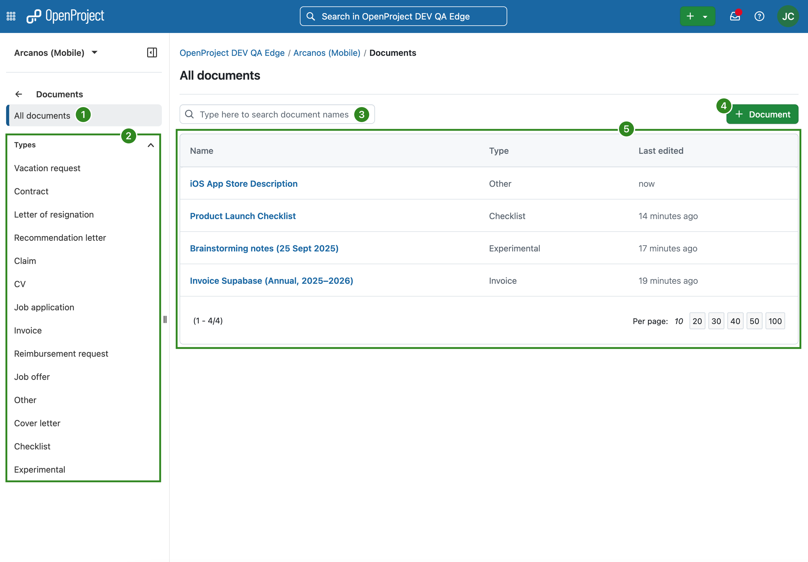
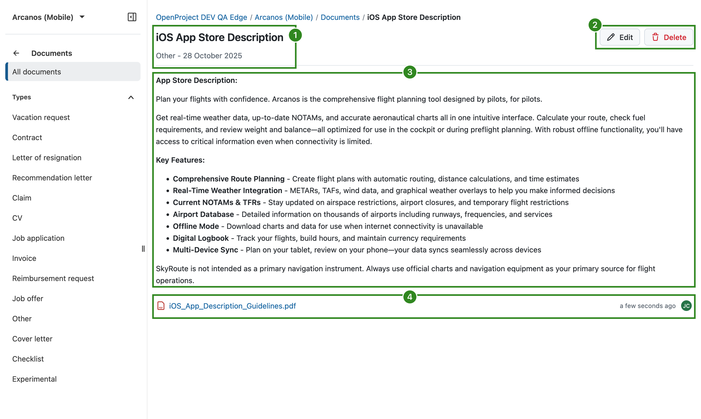

---
sidebar_navigation:
  title: Documents
  priority: 770
description: Create documents and attach files in OpenProject.
keywords: documents
---

# Documents

The Documents module allows you to write or upload documents directly to the project.

> [!NOTE]
> Please note that this module only allows you to manually write or upload documents directly to a project. For more advanced functionalities, please take a look at the [file storages integrations](../file-management).

## Document index

To use the Documents module, make sure it is enabled in the Project settings of your project (Project settings → Modules). 

Once it is enabled, you can navigate to the *Documents* module in the sidebar of your project to get to the Documents index that lists all available documents:

The Documents index page lets you:

1. View all documents
2. Filter by document type
3. Quick-filter the list of documents based on the document title
4. Add a new document
5. View a list of all available documents, including their type and the date they were last edited

A document in OpenProject can be:

- a text written directly in the editor of a document
- a file uploaded and attached to a document
- both a file uploaded and attached to a document, with a text note that describes it

## View a document

To view a document, simply click on the name of a document in the index. You will then see the document:

A document has:

1. A title, a category and creation date
2. Edit and delete buttons
3. The description of the document (or the document text itself)
4. Attachments

## Add a new document to the project

To create a new document, click on the *+ Document* button. 

In the form that appears, select the document category, give it a title and an optional description. You can optionally also attach a file to the document.

Please note that that these document categories are created by the administrator of your instance.

The uploaded documents are visible to all project members who have the necessary permissions.

> [!NOTE]
> There is no versioning of documents. An edit of any field or the contents of the document is visible to all members.

## Edit or delete a project document

You can edit or delete documents anytime. To do that, click on the *Edit* button when viewing a document. This will take you to edit view:

## Frequently asked questions (FAQ)

### Is there a size limit for uploading documents to the OpenProject Enterprise cloud edition?

There is no limit in OpenProject in terms of the number of files that you can upload and work with in OpenProject. There is only a restriction in terms of the maximum file size: A file can have a size up to 256 MB.
