---
sidebar_navigation:
  title: One-time meetings
  priority: 900
description: Manage meetings with agenda and meeting minutes in OpenProject.
keywords: meetings, dynamic meetings, agenda, minutes, one-time meeting, draft mode, presentation mode, meeting draft, meeting presentation
---

# One-time meetings

> [!NOTE]
> With OpenProject 13.1 we introduced dynamic meetings alongside classic meetings. 
> With OpenProject 15.3 dynamic meetings are replaced by [one-time meetings](../one-time-meetings) and [recurring meetings](../recurring-meetings) to further improve meeting management.
> With OpenProject 16.0 classic meetings were removed from OpenProject. Read more about this change [in this blog article](https://www.openproject.org/blog/end-classic-meetings-may-2025/).

For information on setting up recurring meeting series and templates, please refer to [this page](../recurring-meetings). Note that individual occurrences of a recurring meeting series are one-time meetings and have the same features as described here.

> [!NOTE]
> The **Meetings module needs to be activated** in the [Project settings](../../projects/project-settings/modules/) to be able to create and edit meetings.

| Topic                                                        | Content                                                    |
| ------------------------------------------------------------ | ---------------------------------------------------------- |
| [Create a new meeting](#create-a-new-meeting)                | How to create a new meeting in OpenProject.                |
| [Meetings draft mode](#meeting-draft-mode)                   | How to prepare a new meeting behind the scenes.            |
| [Edit a meeting](#edit-a-meeting)                            | How to edit an existing meeting.                           |
| [Add a work package to the agenda](#add-a-work-package-to-the-agenda) | How to add a work package to a meeting agenda.             |
| [Create or edit the meeting agenda](#create-or-edit-the-meeting-agenda) | How to create or edit the agenda.                          |
| [Agenda backlog](#agenda-backlogs)                           | How to use an agenda backlog.                              |
| [Add meeting participants](#add-meeting-participants)        | How to invite people to a meeting.                         |
| [Add meeting attachments](#meeting-attachments)              | How to add attachments to a meeting.                       |
| [Send email to all participants](#send-email-to-all-participants) | How to send an email to all meeting participants.          |
| [Download a meeting as an iCalendar event](#download-a-meeting-as-an-icalendar-event) | How to download a meeting as an iCalendar event.           |
| [Present a meeting](#present-a-meeting)                      | How to use presentation mode for meetings in OpenProject.  |
| [Close a meeting](#close-a-meeting)                          | How to close a meeting in OpenProject.                     |
| [Re-open a meeting](#re-open-a-meeting)                      | How to re-open a meeting in OpenProject.                   |
| [Export a meeting](#export-a-meeting)                        | How to export a meeting as a PDF in OpenProject.           |
| [Copy a meeting](#copy-a-meeting)                            | How to copy a meeting in OpenProject (recurring meetings). |
| [Delete a meeting](#delete-a-meeting)                        | How to delete a meeting in OpenProject.                    |

## Create and edit one-time meetings

### Create a new meeting

You can either create a meeting from within a project or from the global **Meetings** module.

To create a new meeting, click the green **+ Meeting** button in the upper right corner and select what type of meeting you want to create. You can choose between **one-time and recurring meetings**. 

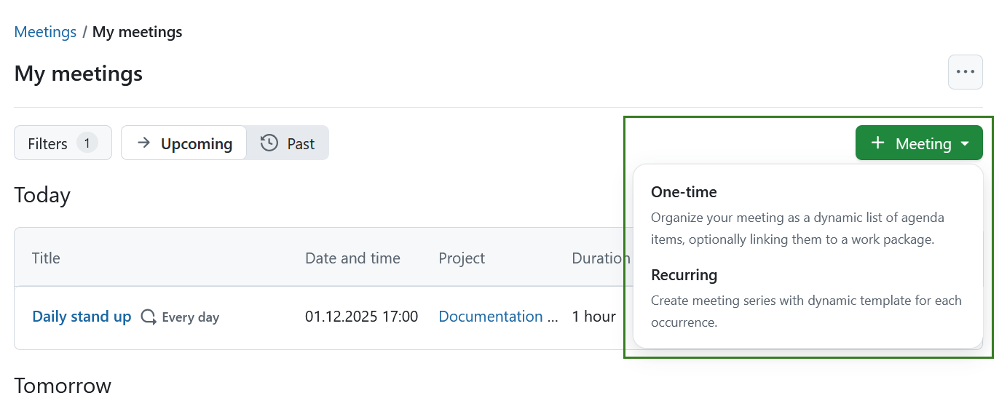

For steps on setting up recurring meetings please consult [this page](../recurring-meetings).

If you choose the **one-time** option, enter your meeting's title, location, start date and time, and duration. 

If you are creating a meeting from a global module you will first need to select a project to which the meeting is attributed. 

> [!TIP] 
> Duration can be entered both in hours and minutes. For example for a meeting that should last for 1.5 hours, you can enter:
>
> - 1.5h
> - 90m
> - 90min
> - 1:30

Click the **Create meeting** button to save your changes. A new meeting will be created. It will initially be in **draft mode**, as indicated by the status message and the corresponding  banner. You can then proceed to add more details to the meeting.

### Meeting draft mode 

**Draft mode** allows you to prepare the meeting in advance. You can structure or refine agenda items and work on the material without initiating the meeting. This mode enables internal meeting preparation and allows freely adjusting meeting participants without them being notified at this stage.

In draft mode, the meeting status indicator does not have drop-down options. No email notifications or invites are sent out in draft mode.

After creating a meeting, you can set up a **meeting agenda** in draft mode. You can also edit the agenda at any time after opening the meeting.

Once you are done editing the draft, click the **Open meeting** button in the top right corner. 

This will open a dialog, in which you can choose whether an invite and updates should be sent out to meeting participants or not. Depending on your choice, a banner will explain what action will follow. 

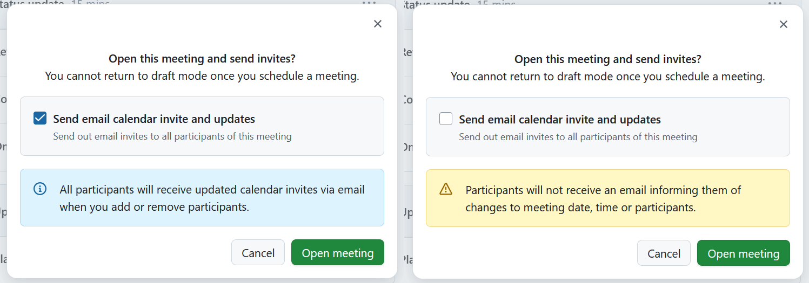

> [!IMPORTANT]
> Once you exit draft mode (by opening a meeting), you can no longer return to it.

Exiting the draft mode will change the meeting status to Open.

### Create or edit the meeting agenda

You can edit a meeting agenda by adding sections, agenda items or existing work packages by selecting the desired option under the green **+ Add** button. You can then add notes to each agenda item.

#### Add an agenda section 

Sections allow you to group agenda items into blocks for better organization.

To add a section, click on the **+ Add** button at the bottom of the agenda items and select the **Section** option. 

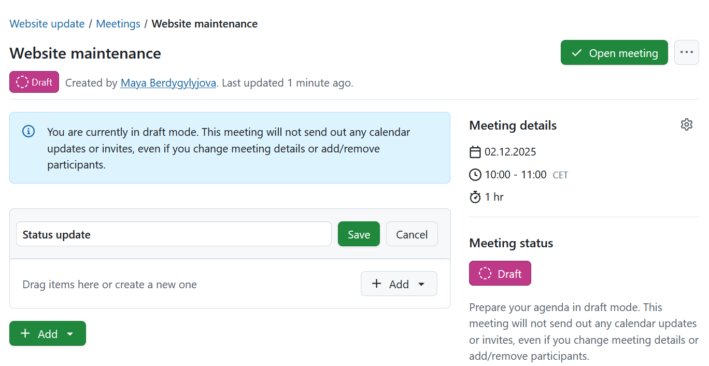

If, prior to creating your first section, your meeting already had existing [agenda items](#add-an-agenda-item), they will automatically be contained in a section called **Untitled section**. You can rename this section if you wish. 

> [!NOTE]
> If you use sections, all agenda items must have sections.

After adding a section, you can specify it further by [adding agenda items](#add-an-agenda-item) or [work packages](#link-a-work-package-to-a-meeting) to it. 

You can also add agenda items to specific sections by either dragging and dropping items into each section, or by clicking on the **More** button (⋯) and choosing your desired action.

This menu also lets you rename a section, move it or delete the entire section by selecting the respective option from the dropdown menu behind the **More** (⋯) icon on the right side. If a section is moved, the agenda items will move along with it. 

> [!TIP]
> You can also re-arrange sections by dragging and dropping sections up and down.

> [!IMPORTANT]
> Deleting a section will delete all containing agenda items. If a section contains agenda items, you will be asked for confirmation before deletion.

#### Add an agenda item

If you select the **Agenda item** option, you can name that item, add notes, set the anticipated duration in minutes and select a user to be displayed next to the agenda item.  This could for example be a meeting or a project member that is accountable for the item or someone who will present that particular topic. 

By default, when creating an agenda item, this will be pre-filled with the name of the user adding the agenda item, but it can either be removed or replaced by one of the other meeting participants.

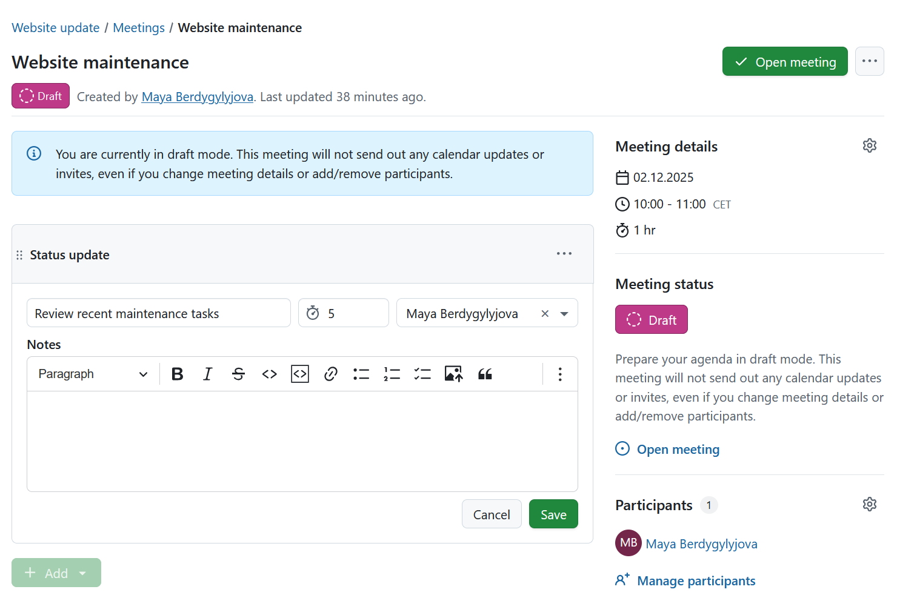

Sections will show the sum of all the durations of all containing items (or at least, those that have a duration specified).

> [!TIP]
> If you need to store the agenda outside of OpenProject, you can generate an optimized PDF using the print function (Ctrl/Cmd + P).

#### Link a work package to a meeting

If you select the **Work package** option, you can link a work package by entering either a work package ID, or starting to type in a keyword, which will open a list of possible options.

#### Edit a meeting agenda

After you have finalized the agenda, you can always edit the agenda, items, add notes, move an item up or down or delete it. Clicking on the **More** (three dots) menu icon on the right edge of each agenda item will display a menu of available options, including editing, copying link to clipboard, moving the agenda item within the agenda or to the backlog, or deleting it.

You may also re-order agenda items by clicking on the drag handle (the icon with six dots) on the left edge of each agenda item and dragging that item above or below.

The durations of each agenda item are automatically summed up. If that sum exceeds the planned duration entered in *Meeting Details*, the duration of those agenda times that exceed the planned duration will appear in red to warn you of the fact.

### Agenda backlogs

An **agenda backlog** is a special pre-existing section below the actual meeting agenda where additional agenda items can be listed before being added to that particular meeting. This allows users to propose topics that are then picked up by the meeting organizer either before or during the actual meeting. 

The backlog can be expanded or collapsed by clicking on the title.

> [!TIP]
> By default, the backlog is expanded when the meeting status is *open*, collapsed if the meeting status is *in progress*, and hidden if the meeting is *closed*.

#### Add and edit items to agenda backlogs

You can add agenda items and link work packages in the same way as you would within the meeting agenda, by dragging and dropping agenda items elsewhere in the meeting or by using the dropdown options of the More (three dots) icon on the right. 

That same *More* menu also allows editing, reordering, adding notes or deleting an item in the agenda backlog. 

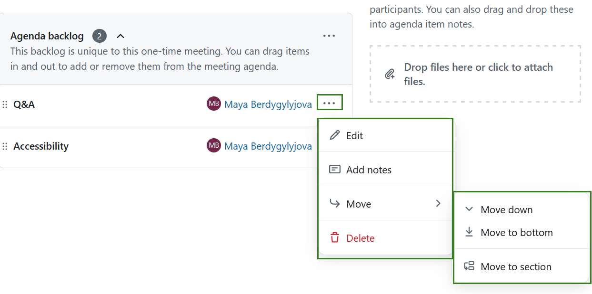

#### Clear agenda backlogs

You can either remove single items from an agenda backlog or clear an entire backlog by clicking the *Clear backlog* option under More (three dots) menu next to the backlog name. Use this option with caution, as the action cannot be undone.

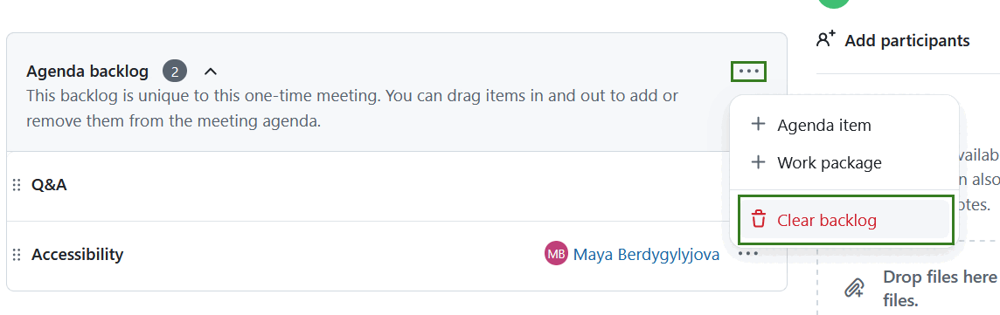

### Add a work package to the agenda

There are two ways to add a work package to a meeting agenda.

- **From the Meetings module**: using the **+ Add** button [add a work package agenda item](#link-a-work-package-to-a-meeting) or
- **From a particular work package**: using the **+ Add to meeting** button on the [Meetings tab](../../work-packages/add-work-packages-to-meetings)

You can add a work package to both upcoming or past meetings as long as the work package is marked **open**.

> [!TIP]
> The upcoming meetings are displayed in chronological order, from the nearest meeting to the most distant. 
> The past meetings are displayed in reverse chronological order, from the most recent meeting to the oldest.

### Edit a meeting

If you want to change the details of a meeting, for example its time or location, open the meetings details view by clicking the cogwheel icon next to the **Meeting details**.

An edit screen will be displayed, where you can adjust the date, time, duration and location of the meeting. Depending on whether email calendar updates are enabled or disabled, a corresponding banner in the form will indicate whether an update will be sent after the changes are saved.

Do not forget to save the changes by clicking the **Save** button. Cancel will bring you back to the details view.

> [!TIP]
> If someone else edits or updates the current meeting page at the same time and saves their changes, you and all other users on the same page will be notified of this with a small banner at the top of the page. Click the **Reload** button to load the updated version of the page. 
>
> If you are in the [presentation mode](#present-a-meeting), changes will load automatically, without the banner being displayed.

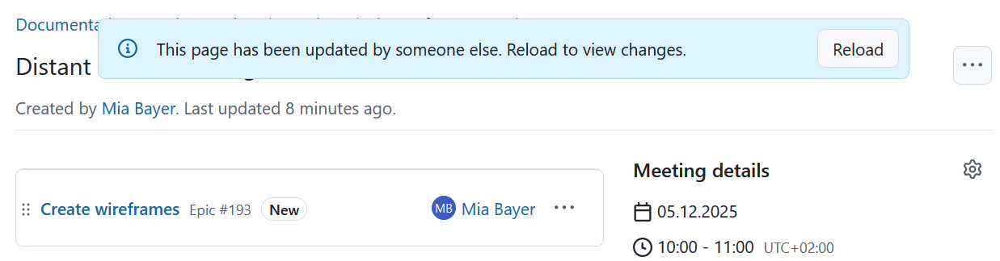

In order to edit the title of the meeting select the dropdown menu behind the three dots and select the **Edit meeting title**.

## Meeting participants

### Add meeting participants

You will see the list of all the invited project members under **Participants**. You can add participants (Invitees and Attendees) to a meeting in [edit mode](#edit-a-meeting). The process is the same whether you are creating a new meeting or editing an existing one. You can either click the cogwheel icon next to **Participants** section or click the **Manage participants** link under the list of existing participants.

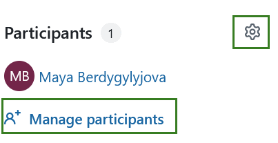

The participants list will show everyone invited to the meeting so far. Initially, it only contains the meeting creator. To add participants, use the search bar to find one or more project members, then click **Add**. Depending on whether email calendar updates are enabled or disabled, a corresponding banner in the form will indicate whether an update will be sent after the changes are saved.

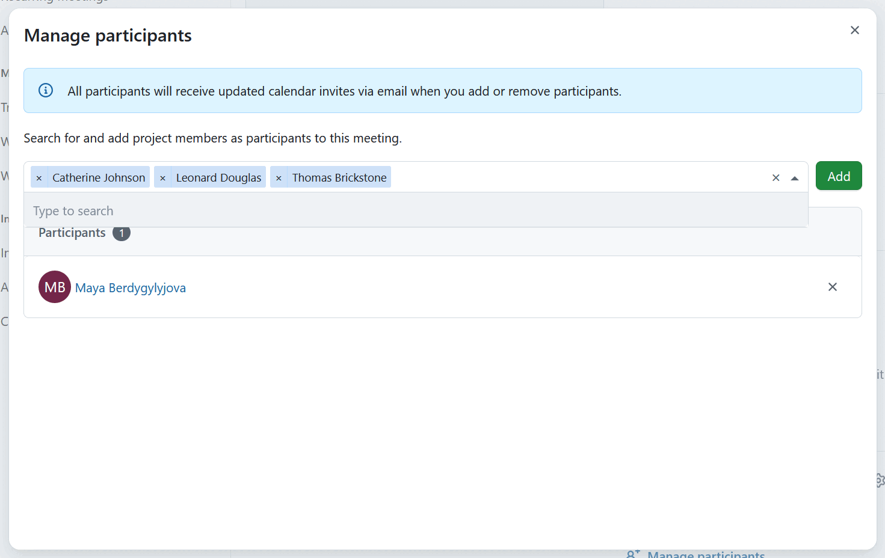

To remove a participant, click the *x* icon on the far right of their name.

Once the meeting has started (status set to *In progress*), you can record attendance by selecting the **Mark as attended** button.

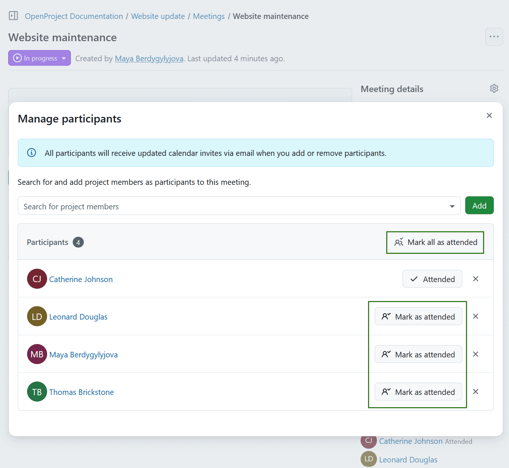

### Send email to all participants

You can send an email reminder to all the meeting participants. Select the dropdown by clicking on the **More** (three dots) icon in the top right corner and select **Email calendar invite to all participants**. An email reminder with the meeting details (including a link to the meeting) is immediately sent to all invitees and attendees.

### Email calendar updates

**Email calendar updates** section on the right side shows whether the setting to notify participants of any meeting changes via email is activated. To enable it click the **Enable** button, to disable it click the **Disable** icon. Here is an example of disabling the calendar updates. 

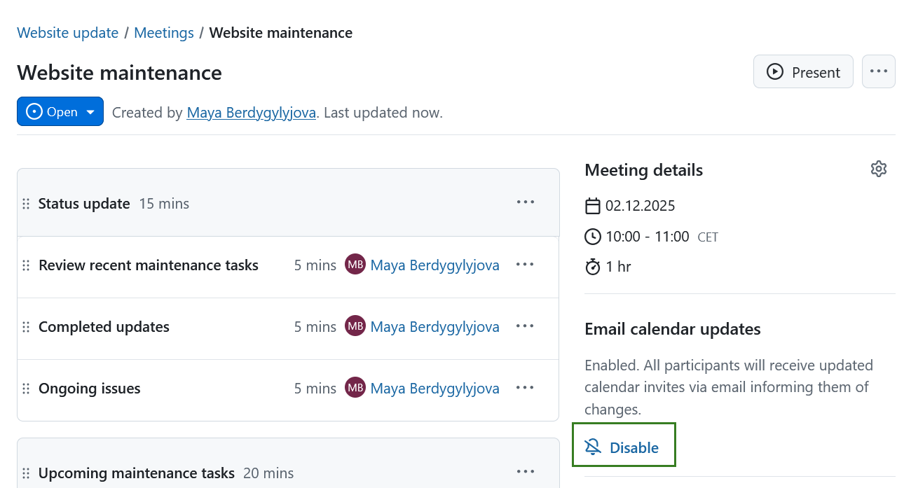

You will then see a warning message informing you of the consequences. You can either cancel or confirm disabling the email updates at this point. 

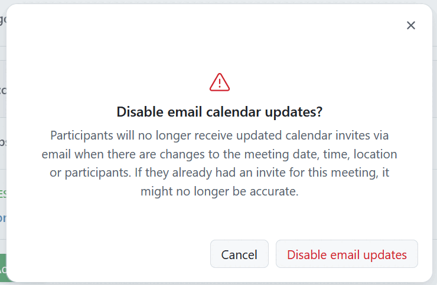

You can always re-activate it by clicking the **Enable** icon. 

## Meeting outcomes
### Add agenda item outcomes

During a meeting, stakeholders will often take certain decisions, add useful information or note down follow-up points. In OpenProject, these can be added as outcomes to each agenda item. To note outcomes, the meeting status has to first be set to [in progress](#mark-meeting-in-progress). Once in progress, there will be a **+ Outcome** button at the end of each agenda item. To add an outcome, simply click this button.

> [!TIP]
>
> To be able to add *Agenda meeting outcomes*, **Manage outcomes** permission needs to be granted under [Roles and permissions](../../../system-admin-guide/users-permissions/roles-permissions/) in system administration.

An editor will appear, allowing you to enter and format text, similar to editing an agenda item. 

Click **Save** to add the outcome agenda.

> [!TIP]
>
> You can save multiple outcomes per agenda item in OpenProject.

After saving an agenda item outcome, you can still edit it. Click the **More** (three dots) menu on the right edge of each outcome item and select *Edit outcome*.

This menu also allows you  to *Copy link to clipboard* and to *Remove the outcome*.

> [!TIP]
> Outcomes are also displayed in the Meetings tab of a work package in a read-only format.

## Meeting attachments

You can add attachments in the meetings in the **Attachments** section in the right bottom corner. You can either user the **+Attach files** link to select files from your computer or drag and drop them.

Added attachments can be added to the Notes section of agenda packages by dragging and dropping them from the Attachments section.

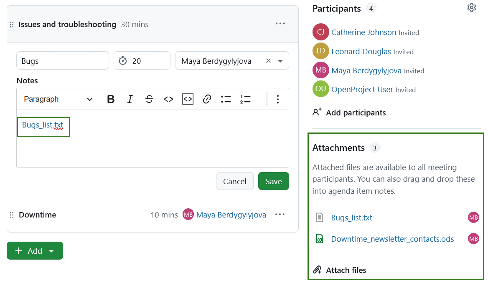

## Meeting history

You can track what changes were made to a meeting and by which user. Select the dropdown by clicking on the **More** (three dots) icon in the top right corner and select **Meeting history**.

This will display meeting history details.

## Download a meeting as an iCalendar event

You can download a meeting as an iCalendar event. Select the dropdown by clicking on the **More** (three dots) menu in the top right corner and select the **Download iCalendar event**.

Read more about [subscribing to a calendar](../../calendar/#subscribe-to-a-calendar).

## Change meeting status
You can change the status of a meeting depending on whether you are preparing it, running it, or finalizing it.

[**Draft mode**](#meeting-draft-mode) is used while preparing a meeting before it is opened. In this mode you can outline the agenda, add or adjust items, work on the content, and adjust participants without running the meeting yet. Draft mode is intended for internal preparation and does not represent the start of the meeting.

Once the preparation stage is finalized, meetings in OpenProject transition to an active phase and can have three different statuses: Open, In Progress, and Closed. Depending on the meeting status, different options are available, such as editing the agenda, adding outcomes, or finalizing the meeting. You can transition between these statuses using the meeting status button  with a drop-down menu under the meeting name or in the right-hand pane.

Clicking on this button will show following status options:

**Open**: reverts the meeting to an editable state, but existing outcomes remain read-only.

**In progress**: enables outcome documentation for agenda items.

**Closed**: locks the meeting and prevents further edits.

### Open meeting status 

When a meeting is *Open*, you can prepare the agenda by adding or removing agenda items. Once the agenda is ready, the meeting can be started.  

> [!TIP]
>
> In an open meeting state in addition to the status menu, you will directly see the **Start a meeting** link on the right.

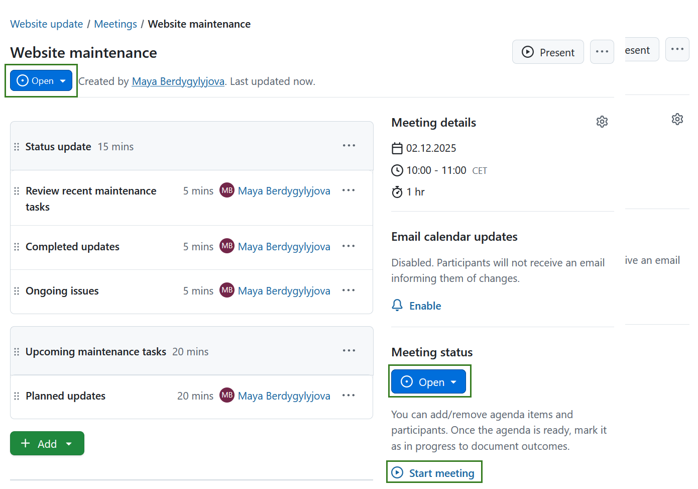

### Mark meeting in progress

Once the agenda is ready, the meeting can be started. To mark a meeting in progress you can use the dropdown status menu and select *In progress* or click the *Start meeting* link on the right side.

Setting a meeting *In progress* allows adding [**Agenda item outcomes**](#add-agenda-item-outcomes) by using the **+ Outcome** buttons.

Once all outcomes are documented, you can close the meeting. To do that use the dropdown status menu on the right side or under the meeting name. 

### Close a meeting

Once all outcomes are documented, you can close the meeting. To do that use the dropdown status menu on the right side or under the meeting name. 

> [!TIP]
> In a meeting marked *in progress* in addition to the status menu, you will directly see the **Close meeting** link on the right. 

Closing a meeting locks the current state and makes it read-only.

When a meeting is closed, you can still copy a link to a specific agenda item or outcome. Click the More (three dots) icon on the right and select *Copy to clipboard*.

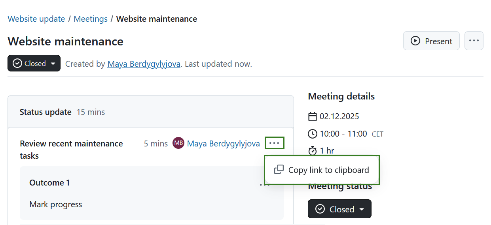

### Re-open a meeting

Once a meeting has been closed, it can no longer be edited. Project  members with the permission to edit and close meetings will, however,  see a **Re-open meeting** option. Clicking on this re-opens a meeting and allows further editing.

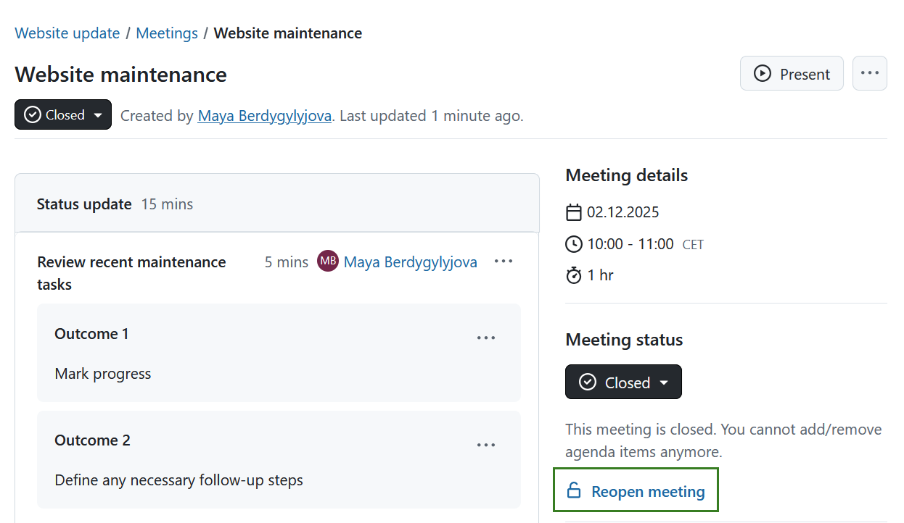

## Present a meeting

**Presentation mode** is available when you want to show the meeting content in a clean, non-editable view. This mode is intended for presenting the agenda or meeting material to participants during or before the meeting without distractions. However, agenda items can be edited in presentation mode if needed.

Presentation mode can be used regardless of the meeting status (open, in progress or closed). However, a presentation mode is not available in a draft mode or for a meeting template (recurring meetings).

> [!TIP]
> Presentation mode generally does not change the meeting status, with one exception. If a meeting has the status *Open*, clicking the *Present* button will automatically change the meeting status to *In progress*. 

To initiate a presentation mode click the present button in the top right corner. 

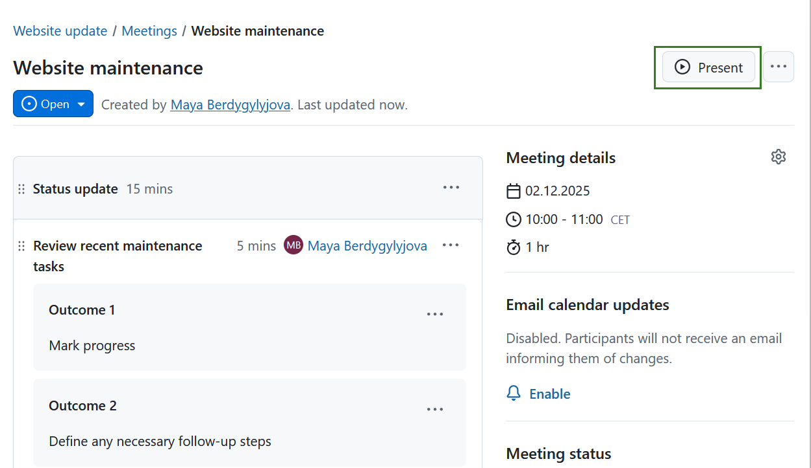

Presentation mode will be activated. It will show the following: 

1. The meeting title 
2. Exit presentation button
3. Current section (if any)
4. Current item of the selected section
5. Button to add outcomes directly during the presentation 
6. Footer with agenda progress, a running timer, and Previous / Next navigation buttons showing item titles and section titles when applicable

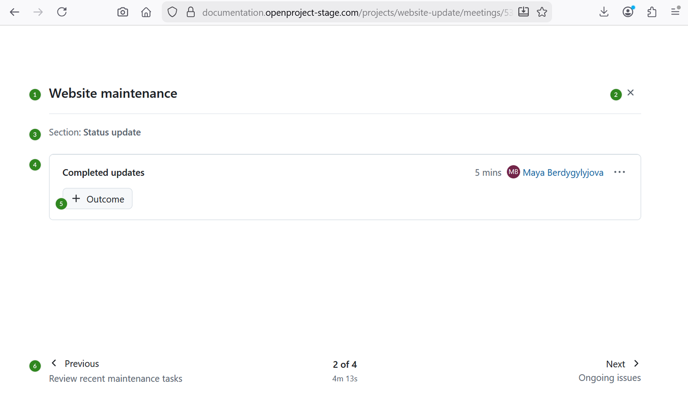

You can navigate through the meeting presentation by either clicking the *Previous/Next* navigation buttons, or by using arrow keys of your keyboard.

Meeting changes made during the presentation are updated automatically unless an item is actively being edited.

To exit the presentation mode click the Exit presentation button in the header. 

>  [!NOTE]
>
> Some browsers may block automatic full-screen mode. In this case you can manually enable full-screen using the browser controls.

## Export a meeting

You can export a meeting in OpenProject in a PDF format. A meeting can be exported regardless of the meeting state (open, in progress or closed). 

To export a meeting select the dropdown by clicking on the **More** (three dots) icon in the top right corner and select **Export PDF**. 

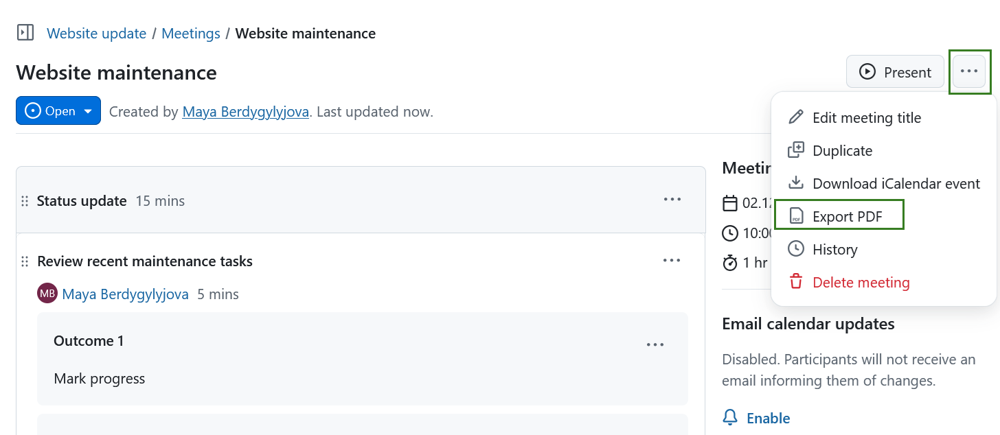

The **Export PDF** dialogue will open. Here you can specify what elements should be included into the PDF and specify the footer text. Options include: 

- Include list of participants: a list of participants will be preset above the meeting agenda (**this option is selected by default**)
- Include list of attachments: a list containing the filenames of attachments will be appended at the end
- Include backlog: includes list of backlog elements
- Include agenda outcomes: includes agenda outcomes (**if your agenda outcomes contain confidential information, you can choose to not include them in the export**).

You can also specify the **Footer text**, which will appear on the bottom of every page. The default text for the PDF export footer is the project name.

Click the **Download** button to generated a PDF. First page of the PDF is the title page. The generated PDF will include all the meeting details and agenda. Meeting participants, agenda outcomes, a list of attachments and backlog items will only be included if selected for the export. 

> [!NOTE]
> Macros from the editor macros dropdown are not supported in the PDF.

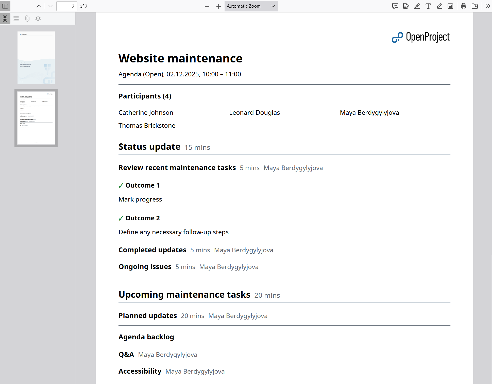

## Copy a meeting

You can copy an existing meeting. This is useful if you have recurring meetings. To copy a meeting, click on the three dots in the top right corner and select **Duplicate**.

A modal will open, which will allow you adjust the title, time, location and further details of the copied meeting. By default, the date for the copied meeting will be set to the next day. You also have an option of copying the agenda, attachments and the list of participants. 

If you copy a closed meeting, the new meeting status will automatically be set to open. Don't forget to **save** the copied meeting by clicking the **Create meeting** button.

## Delete a meeting

You can delete a meeting. To do so, click on the three dots in the top right corner, select **Delete meeting** and confirm your choice.

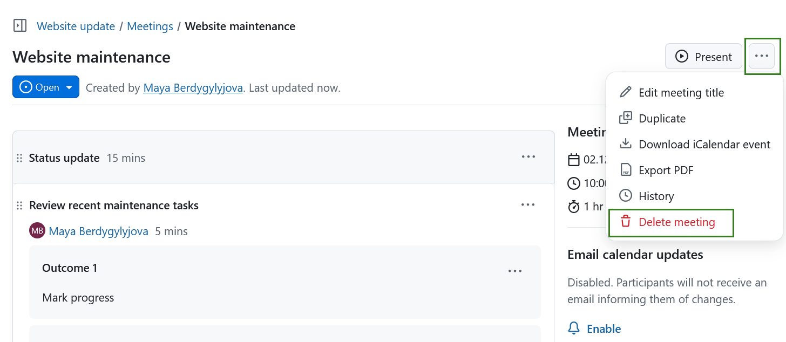
