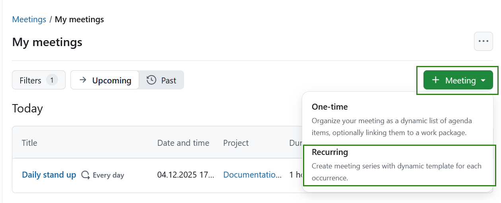
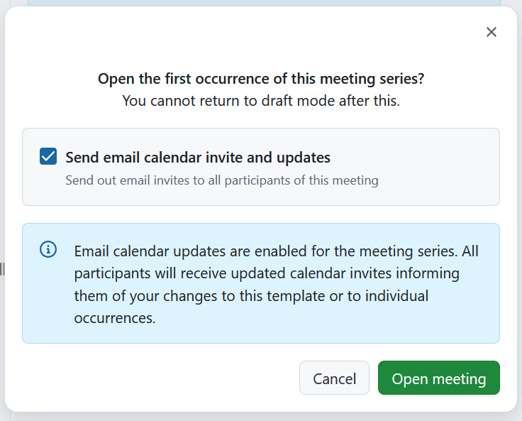
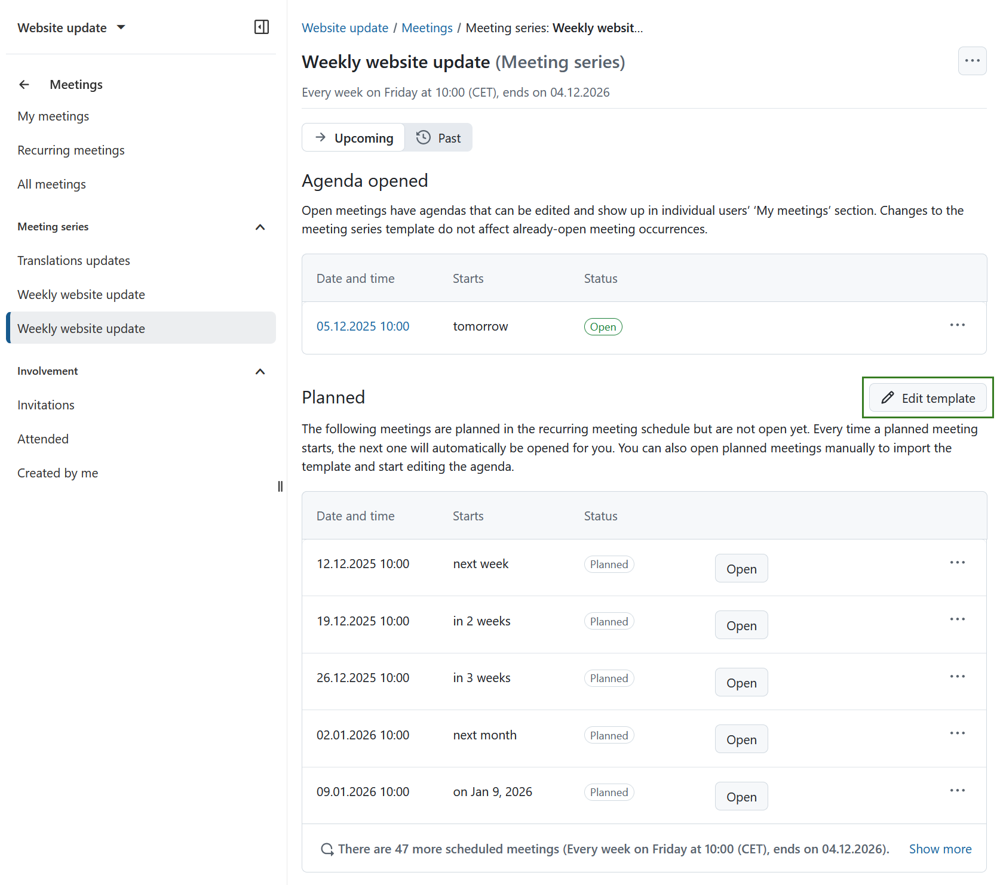
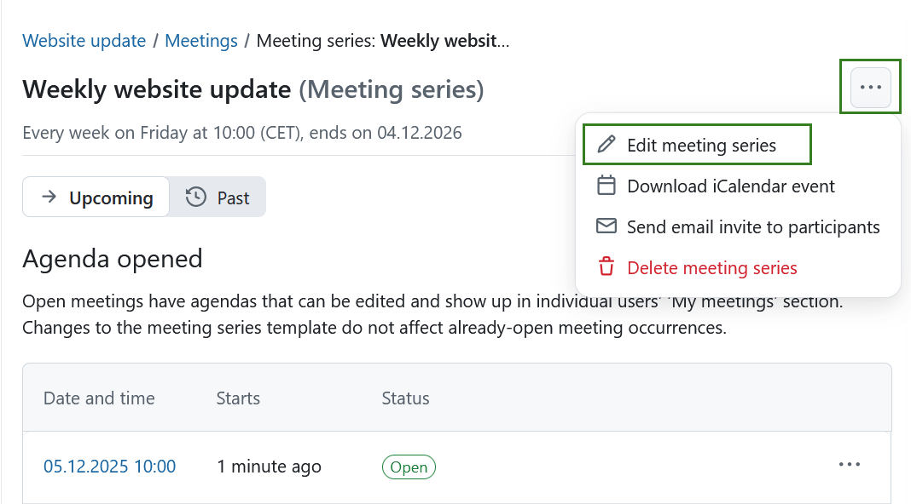
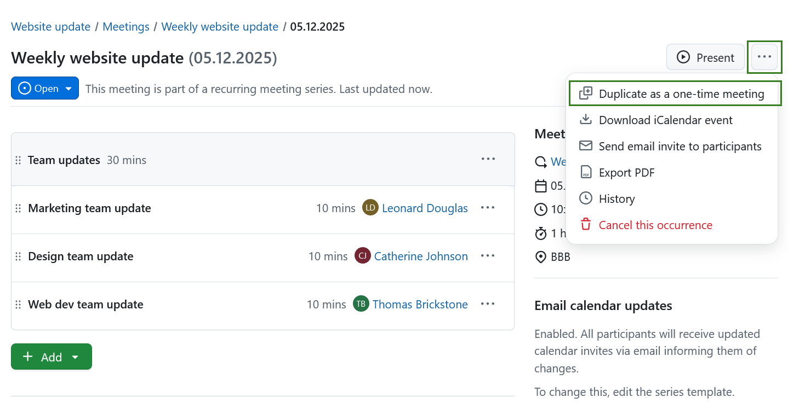
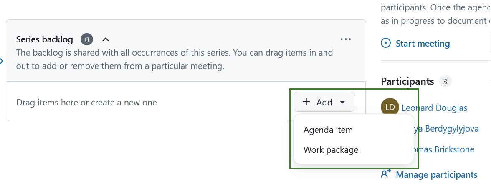

---
sidebar_navigation:
  title: Recurring meetings
  priority: 800
description: Manage meetings with agenda and meeting minutes in OpenProject.
keywords: meetings, dynamic meetings, agenda, minutes, recurring meeting
---

# Recurring meetings management

With OpenProject 15.3, meetings were enhanced by introducing a clear distinction between **one-time meetings** and **recurring meetings**. This page covers the features and functionalities of recurring meetings. For information on one-time meetings, please refer to [this page](../one-time-meetings). 

Recurring meetings are helpful to schedule and organize meetings that happen regularly and which have the same structure. They consist of individual occurrences that repeat with a defined frequency and interval, and are all based on a meeting template consisting of predefined sections, agenda items and participants. 

> [!NOTE]
> The **Meetings module needs to be activated** in the [Project settings](../../projects/project-settings/modules/) to be able to create and edit meetings.

| Topic                                                        | Content                                                      |
| ------------------------------------------------------------ | ------------------------------------------------------------ |
| [Create and edit recurring meetings](#create-and-edit-recurring-meetings) | How to create and edit recurring meetings in OpenProject.    |
| [Edit recurring meetings template](#edit-recurring-meetings-template) | How to edit a template for recurring meeting series.         |
| [Edit recurring meeting series](#edit-recurring-meeting-series) | How to edit  recurring meeting series in OpenProject.        |
| [Edit a recurring meeting occurrence](#edit-a-recurring-meeting-occurrence) | How to edit a single meeting within recurring meeting series. |

## Create and edit recurring meetings

You can either create a recurring meeting from within a project or from the global **Meetings** module. For steps on setting up one-time meetings please consult [this page](../one-time-meetings).

To create a new recurring meeting, click the green **+ Meeting** button in the upper right corner and select **Recurring**. 

Enter your meeting's title, location, start and end date and time, duration, frequency and interval. Note that if you are creating a meeting from a global module you will first need to select a project to which the meeting belongs.

> [!TIP] 
> Duration can be entered both in hours and minutes. For example for a meeting that should last for 1.5 hours, you can enter:
>
> - 1.5h
> - 90m
> - 90min
> - 1:30

**Frequency** offers following options: 

- Every day
- Every working day
- Every week

**Interval** is a **required** integer field that defines the recurrence pattern of a meeting series. It specifies how often a meeting should repeat within the selected recurrence scheme. For example:

- Daily, Interval = 2 → The meeting occurs every two days.
- Weekly, Interval = 4 → The meeting occurs every four weeks.

> [!TIP]
> For **working day-based recurrence**, the **Interval field is hidden** and always set to 1, meaning the meeting occurs on every working day without customization.

**Meeting series ends** field is a select dropdown field that defines when a recurring meeting series should come to an end. The following options are possible:

- **Never** - the meeting series runs indefinitely
- **After a specific date** – lets you specify an **end date** (the meeting might end before or on this date, depending on the original start date and frequency)
- **After a number of occurrences** – lets you specify the number of individual **occurrences** after which the series will end

Click the **Create meeting series** button to save your changes. This will create the recurring meeting series and redirect you to the meeting template page. 

## Edit recurring meetings template

After creating a meeting series, you are redirected to the recurring meeting template, which will open in the [draft mode](../one-time-meetings/#meeting-draft-mode) by default. At this point, no meeting within the recurring meeting series has yet been set up. You need to first define a template that will be the basis of all upcoming meetings. In other words, all new iterations of meetings in the series will be a copy of this template.

You can define the template the same way that you would a [one-time meeting](../one-time-meetings): you can add sections, agenda items, work packages and even a set of participants. Keep in mind that every new occurrence of a meeting in the series will use this template. After you are done editing the meeting template, you can create the first meeting by clicking **Open first meeting** button, which will direct you to the first open meeting occurrence in the new series.

> [!IMPORTANT]
> Once you leave the draft mode, you can no longer return, i.e. you can still edit your template, but the changes may be visible (depending on the e-mail notification status).

You will be asked to decide whether or not meeting series participants should receive calendar invites and updates. Depending on your choice, a corresponding banner will inform you of the consequent actions. 

You can always adjust the template at a later date by selecting the meeting series from the left hand menu and clicking **Edit template** on the meeting series index page. These changes will not affect past or already created (opened) meetings. 

## Edit recurring meetings

### Edit recurring meeting series

The left side menu displays all existing meeting series. Click on one will open the index page for this particular series, displaying all meeting occurrences planned for this series, and are grouped into:

- **Open**: lists all meetings within the series that have been opened and can be edited. All open meetings will also be displayed under *My Meetings* section. 
- **Planned**: lists all meetings within the selected meeting series that are scheduled, but not yet open.  Every time a planned meeting starts, the next one will open automatically. You can also open any of the planned  meetings manually to import the template and start editing the agenda.

> [!TIP]
> Once a meeting is open, changes to the template do not affect it. 

To edit the meeting series, select the **More** (three dots) icon on the far right side of the meeting series name and select *Edit meeting series*.

Within the same menu you also have the following options:

- Download meeting series as iCalendar event

- Send email to all participants

- End meeting series (this option is only displayed if the series has not been ended before)

- Delete meeting series

  

### Edit a recurring meeting occurrence

To edit a single meeting within recurring meeting series you have to open it first by clicking the **Open** button next to the meeting. It will then be displayed under *Agenda opened* section on the recurring meeting index page, where you can click the meeting date and time. 

This will open the specific meeting page. You can then edit the meeting by using same functions as for [editing one-time meetings](../one-time-meetings), including adding sections and agenda points, documenting agenda item outcomes, inviting participants and adding attachments.

Additionally you can copy a specific meeting series occurrence as a one-time meeting. To do that click the **More** (three dots) icon and select **Duplicate as one-time meeting**.

Within the same menu you also have the following options:

- Download iCalendar event
- Send email invite to participants
- Export PDF
- History
- Cancel this occurrence

### Move an agenda item to next meeting

In addition to all the options available when clicking on the three-dot **More** (⋯) menu for an agenda item in when [editing one-time meetings](../one-time-meetings), you will see one additional option to move the agenda item to the next meeting occurrence in the series.

## Meeting backlogs for recurring meetings

### Series backlogs

A **series backlog** is a special pre-existing section below the actual agenda items of that occurrence where additional agenda items maybe be listed for consideration. These items may then be added to a particular occurrence by the meeting organizer either before or during a meeting. 

The backlog can be collapsed or expanded by clicking on the the title. Agenda backlog for recurring meetings will be visible for all meetings in the series. 

> [!TIP]
> By default, the backlog is expanded when the meeting status is *open*, collapsed if the meeting status is *in progress*, and hidden if the meeting is *closed*.

#### Add and edit items to series backlogs

You can add agenda items and link work packages in the same way as you would within the meeting agenda: either by dragging and dropping via the handle on the left or by using the **Add** button. 

The dropdown More (three dots) icon on the right opens a menu allowing editing, reordering or deleting an item in the series backlog.  Here you can also  add notes and move a backlog item to a current meeting. If there are multiple sections in the current meeting, you will be asked to select a section first. 

#### Clear agenda backlogs

You can either remove single items from a series backlog or clear an entire backlog by clicking the *Clear backlog* option under More (three dots) menu next to the backlog name. Use this option with caution, as the action cannot be undone.

